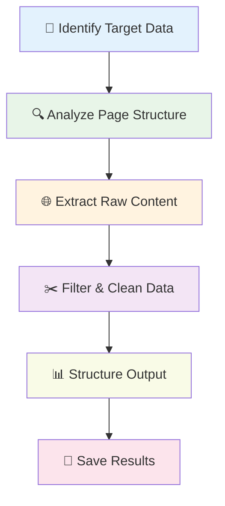
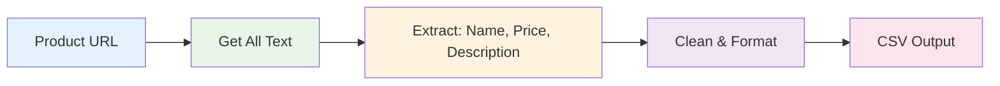
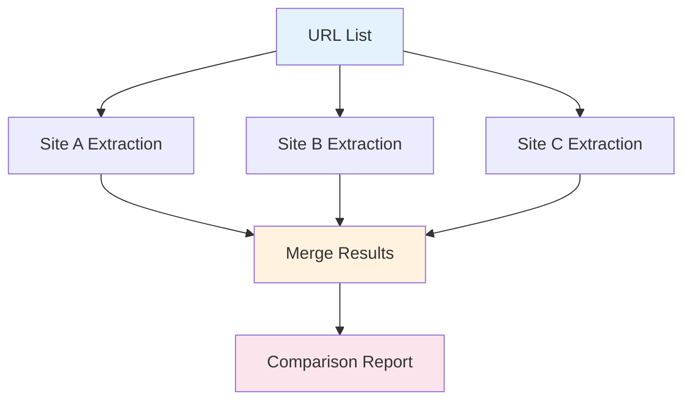

# Extract Data from Any Website

## What You'll Learn

Master a reliable, universal approach to extracting data from any website. This guide teaches you the core method that works across different site structures and technologies.

**⏱️ Time**: 30 minutes  
**🎯 Difficulty**: Intermediate  
**✅ Result**: Universal data extraction workflow you can adapt to any site

## The Universal Method

Every successful web extraction follows the same pattern, regardless of the website:



## Step 1: Analyze Your Target

Before building any workflow, spend 5 minutes understanding what you're extracting:

### Identify Data Patterns

**Look for consistent elements:**
- Product names in `<h1>` tags
- Prices in elements with class `price`
- Descriptions in `<p>` tags with specific classes
- Images in predictable locations

**Example Analysis:**
```
Target: E-commerce product pages
Data needed: Name, price, description, image URL
Pattern: All products follow same HTML structure
```

### Check for Dynamic Content

**Test these scenarios:**
- Does content load immediately or after page load?
- Are there "Load More" buttons or infinite scroll?
- Does JavaScript modify the content after loading?

**Quick Test**: Disable JavaScript in your browser - if content disappears, it's dynamic.

## Step 2: Build Your Extraction Workflow

### Core Node Setup

Use this proven 4-node pattern that works for 90% of extraction tasks:

1. **Get All Text From Link** - Captures page content
2. **Edit Fields** - Extracts and cleans specific data
3. **Filter** - Removes unwanted results  
4. **Download as File** - Saves structured data

### Configuration Template

**Get All Text From Link:**
```json
{
  "waitForLoad": true,
  "timeout": 20000,
  "textFilters": [
    ".navigation", 
    ".footer", 
    ".sidebar", 
    ".advertisement"
  ]
}
```

**Edit Fields for Data Extraction:**
```json
{
  "operations": [
    {
      "field": "text",
      "operation": "extract_regex",
      "pattern": "Product Name: ([^\\n]+)",
      "output_field": "product_name"
    },
    {
      "field": "text", 
      "operation": "extract_regex",
      "pattern": "\\$([0-9,]+\\.?[0-9]*)",
      "output_field": "price"
    }
  ]
}
```

## Step 3: Handle Common Challenges

### Challenge 1: Dynamic Content

**Problem**: Content loads after page renders  
**Solution**: Increase timeout and enable JavaScript waiting

```json
{
  "waitForLoad": true,
  "timeout": 30000,
  "waitForSelector": ".product-info",
  "dynamicContent": true
}
```

### Challenge 2: Anti-Bot Protection

**Problem**: Site blocks automated access  
**Solution**: Add realistic delays and headers

```json
{
  "requestDelay": 2000,
  "userAgent": "Mozilla/5.0 (compatible browser string)",
  "respectRobotsTxt": true
}
```

### Challenge 3: Inconsistent Data Format

**Problem**: Data appears in different formats across pages  
**Solution**: Use multiple extraction patterns

```json
{
  "operations": [
    {
      "field": "text",
      "operation": "extract_regex",
      "pattern": "Price: \\$([0-9,]+\\.?[0-9]*)",
      "output_field": "price_format1"
    },
    {
      "field": "text",
      "operation": "extract_regex", 
      "pattern": "\\$([0-9,]+\\.?[0-9]*)",
      "output_field": "price_format2"
    },
    {
      "field": "price_format1,price_format2",
      "operation": "coalesce",
      "output_field": "final_price"
    }
  ]
}
```

## Step 4: Scale Your Extraction

### Single Page → Multiple Pages

**URL List Processing:**
```json
{
  "urls": [
    "https://example.com/product1",
    "https://example.com/product2", 
    "https://example.com/product3"
  ],
  "batch_size": 5,
  "delay_between_batches": 3000
}
```

### Handle Pagination

**Auto-Discovery Pattern:**
```json
{
  "pagination": {
    "next_button_selector": ".next-page",
    "max_pages": 50,
    "stop_condition": "no_new_data"
  }
}
```

## Real-World Examples

### Example 1: Job Listings

**Target**: Job board with consistent structure  
**Data**: Title, company, salary, location, description

**Extraction Pattern:**
```json
{
  "operations": [
    {
      "field": "text",
      "operation": "extract_regex",
      "pattern": "Job Title: ([^\\n]+)",
      "output_field": "title"
    },
    {
      "field": "text",
      "operation": "extract_regex",
      "pattern": "Company: ([^\\n]+)",
      "output_field": "company"
    },
    {
      "field": "text",
      "operation": "extract_regex",
      "pattern": "Salary: \\$([0-9,]+)",
      "output_field": "salary"
    }
  ]
}
```

### Example 2: Real Estate Listings

**Target**: Property listings with images and details  
**Data**: Price, bedrooms, bathrooms, square footage, address

**Multi-Pattern Extraction:**
```json
{
  "operations": [
    {
      "field": "text",
      "operation": "extract_regex",
      "pattern": "\\$([0-9,]+)",
      "output_field": "price"
    },
    {
      "field": "text",
      "operation": "extract_regex", 
      "pattern": "([0-9]+) bed",
      "output_field": "bedrooms"
    },
    {
      "field": "text",
      "operation": "extract_regex",
      "pattern": "([0-9,]+) sq ft",
      "output_field": "square_feet"
    }
  ]
}
```

## Troubleshooting Guide

### Top 5 Common Issues

| Issue | Symptoms | Solution |
|-------|----------|----------|
| **No data extracted** | Empty results or null values | Check if site requires JavaScript, increase timeout |
| **Partial data only** | Some fields missing | Verify regex patterns match actual content format |
| **Blocked requests** | 403/429 errors | Add delays, rotate user agents, respect rate limits |
| **Inconsistent results** | Data varies between runs | Handle dynamic content, add wait conditions |
| **Performance issues** | Slow extraction | Optimize filters, reduce timeout, batch processing |

### Debugging Workflow

1. **Test with single URL first** - Verify pattern works
2. **Check raw extracted text** - Ensure content is captured
3. **Validate regex patterns** - Use online regex testers
4. **Monitor for errors** - Check browser console for blocks
5. **Optimize gradually** - Add complexity only when needed

## Data Flow Examples

### Simple Product Extraction



### Multi-Site Comparison



## Best Practices

### Performance Optimization

- **Filter early**: Remove unnecessary content before processing
- **Batch requests**: Process multiple URLs efficiently  
- **Cache results**: Avoid re-extracting unchanged data
- **Monitor resources**: Track memory and processing time

### Reliability Guidelines

- **Handle errors gracefully**: Plan for failed extractions
- **Validate data quality**: Check for expected formats
- **Respect site policies**: Follow robots.txt and terms of service
- **Monitor for changes**: Sites update their structure regularly

### Ethical Considerations

- **Respect rate limits**: Don't overwhelm target servers
- **Check legal compliance**: Ensure extraction is permitted
- **Protect privacy**: Handle personal data appropriately
- **Give attribution**: Credit data sources when required

## Advanced Techniques

### JavaScript-Heavy Sites

For sites that heavily rely on JavaScript:

```json
{
  "browser_automation": true,
  "wait_for_element": ".dynamic-content",
  "execute_javascript": "window.scrollTo(0, document.body.scrollHeight)",
  "screenshot_before_extract": true
}
```

### API Discovery

Sometimes extraction reveals hidden APIs:

1. Monitor network requests during manual browsing
2. Look for JSON endpoints that provide structured data
3. Use API endpoints instead of HTML scraping when available

## What's Next?

Master these related techniques:

- **[Create AI-Powered Content Analysis](create-ai-content-analysis)** - Process extracted data with AI
- **[Build a Price Monitoring System](build-price-monitoring-system)** - Complete monitoring solution
- **[Extract Product Prices](/usage/quick-wins/extract-product-prices)** - Quick focused example

## Complete Workflow Template

```json
{
  "workflow": {
    "name": "Universal Data Extractor",
    "description": "Adaptable workflow for any website",
    "nodes": [
      {
        "type": "LambdaInput",
        "config": {
          "urls": ["https://example.com/page1", "https://example.com/page2"]
        }
      },
      {
        "type": "GetAllTextFromLink",
        "config": {
          "waitForLoad": true,
          "timeout": 20000,
          "textFilters": [".navigation", ".footer", ".ads"]
        }
      },
      {
        "type": "EditFields",
        "config": {
          "operations": [
            {
              "field": "text",
              "operation": "extract_regex",
              "pattern": "Title: ([^\\n]+)",
              "output_field": "title"
            },
            {
              "field": "text",
              "operation": "extract_regex",
              "pattern": "Price: \\$([0-9,]+\\.?[0-9]*)",
              "output_field": "price"
            }
          ]
        }
      },
      {
        "type": "Filter",
        "config": {
          "conditions": [
            {"field": "title", "operation": "not_empty"},
            {"field": "price", "operation": "not_empty"}
          ]
        }
      },
      {
        "type": "DownloadAsFile",
        "config": {
          "format": "csv",
          "filename": "extracted_data_{{timestamp}}.csv"
        }
      }
    ]
  }
}
```

---

**💡 Pro Tip**: Start simple with one data field, then gradually add complexity. The universal method works because it's systematic, not because it's complex.