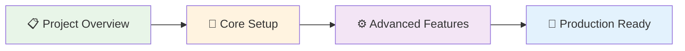

# 📚 How-To Guides

Master `Agentic WorkFlow` by building complete, real-world projects. These comprehensive guides take you from concept to working solution, teaching you professional techniques along the way.

## What Makes These Different?

- **Complete Projects**: Build entire systems, not just individual features
- **Professional Techniques**: Learn industry best practices and patterns
- **Real-World Focus**: Solve actual business problems you'll encounter
- **Scalable Solutions**: Designed to grow with your needs

## Available How-To Guides

### 🌐 Web Data Extraction

**[Extract Data from Any Website](extract-data-from-any-website)**
*30 minutes • 🚀 Intermediate*

Master the universal approach to web data extraction that works on any site. Learn the systematic method professionals use to reliably extract data from any website structure.

**What you'll build**: Universal data extraction workflow
**Skills learned**: Web extraction patterns, data cleaning, error handling
**Use cases**: Product catalogs, job listings, real estate data, research

### 🤖 AI-Powered Analysis

**[Create AI-Powered Content Analysis](create-ai-content-analysis)**
*45 minutes • 🚀 Intermediate*

Build intelligent workflows that analyze and understand web content like a human researcher. Perfect for competitive intelligence and content strategy.

**What you'll build**: AI content analysis system
**Skills learned**: AI prompt engineering, content processing, insight generation
**Use cases**: Competitor analysis, content research, SEO analysis, market intelligence

### 💰 E-commerce & Monitoring

**[Build a Price Monitoring System](build-price-monitoring-system)**
*60 minutes • 🎯 Advanced*

Create a complete, enterprise-ready price monitoring solution with alerts, historical tracking, and business intelligence dashboards.

**What you'll build**: Full price monitoring system
**Skills learned**: System architecture, alert systems, data analytics, automation
**Use cases**: Competitive pricing, market monitoring, business intelligence

## How to Use These Guides

### 1. Choose Your Project

Pick a guide that matches a real problem you want to solve:
- **Need data extraction?** Start with "Extract Data from Any Website"
- **Want AI insights?** Try "Create AI-Powered Content Analysis"
- **Building a business system?** Go for "Build a Price Monitoring System"

### 2. Follow the Structure

Each guide follows a proven learning structure:

- **Project Overview**: Understand what you're building and why
- **Core Setup**: Build the essential functionality step-by-step
- **Advanced Features**: Add professional-grade capabilities
- **Production Ready**: Deploy and scale your solution

### 3. Build Real Solutions

These aren't toy examples - they're production-ready systems you can use immediately:

- **Copy-paste workflows** to get started quickly
- **Customization guides** to adapt to your needs
- **Troubleshooting sections** for common issues
- **Scaling advice** for growing requirements

## Learning Path Recommendations

### For Beginners
1. Start with [Quick Wins](/usage/quick-wins/) to build confidence
2. Try "Extract Data from Any Website" for foundational skills
3. Move to "Create AI-Powered Content Analysis" for AI basics

### For Intermediate Users
1. Begin with "Create AI-Powered Content Analysis"
2. Build "Extract Data from Any Website" for advanced patterns
3. Complete "Build a Price Monitoring System" for system design

### For Advanced Users
1. Jump to "Build a Price Monitoring System" for architecture patterns
2. Use other guides as reference for specific techniques
3. Combine patterns from multiple guides for custom solutions

## Project Complexity Guide

| Guide | Time | Complexity | Skills Required |
|-------|------|------------|-----------------|
| Extract Data from Any Website | 30 min | 🚀 Intermediate | Basic workflow understanding |
| Create AI-Powered Content Analysis | 45 min | 🚀 Intermediate | AI concepts, prompt writing |
| Build a Price Monitoring System | 60 min | 🎯 Advanced | System design, data management |

## Common Patterns You'll Learn

### Data Processing Patterns
- **Extract → Clean → Structure → Store**: Universal data pipeline
- **Batch Processing**: Handle large datasets efficiently
- **Error Handling**: Build resilient workflows

### AI Integration Patterns
- **Content Analysis**: Extract insights from text
- **Prompt Engineering**: Get consistent AI results
- **Multi-step Processing**: Chain AI operations

### System Architecture Patterns
- **Monitoring Systems**: Automated data collection and alerts
- **Scalable Design**: Build systems that grow
- **Production Deployment**: Real-world considerations

## Troubleshooting Support

Each guide includes comprehensive troubleshooting:

- **Common Issues**: Top 5 problems and solutions
- **Debugging Workflows**: Step-by-step problem solving
- **Performance Tips**: Optimize for speed and reliability
- **Error Handling**: Build robust, fault-tolerant systems

## What's Next?

After completing these guides, you'll be ready for:

- **[Advanced AI Workflows](/advanced-ai/)** - Complex AI patterns and techniques
- **[Learning Courses](/learning/)** - Structured skill development
- **Custom Projects** - Build your own unique solutions

## Community Examples

See how others have adapted these guides:

- **E-commerce Price Intelligence**: Extended monitoring system with ML predictions
- **Content Strategy Platform**: AI analysis system for marketing teams
- **Research Automation Suite**: Data extraction system for academic research
- **Competitive Intelligence Dashboard**: Combined monitoring and analysis system

---

**💡 Pro Tip**: Don't try to build everything at once. Master one guide completely, then combine techniques from multiple guides to create your custom solution.