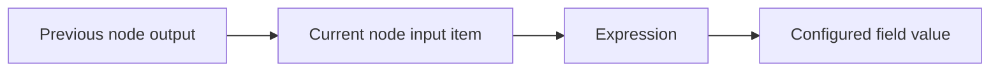

Expressions let you reference values from the current node's input, previous nodes, or linked items. Use them when a field needs dynamic text, a fallback, or a value nested inside an object.

For most workflows, start with the visual mapping UI. Use expressions when you need more control.

## Expression mental model



An expression is written inside double curly braces (`{{ ... }}`) and is evaluated while the node runs. If the node runs for ten items, the expression is evaluated ten times, once for each current item.

## Current input values — `$input`

Use `$input` when the value should come from the data flowing **into** the current node.

- `{{ $input }}` — the whole incoming input.
- `{{ $input.title }}` — a top-level field.
- `{{ $input.metadata.description }}` — a nested field (dot path).
- `{{ $input.0.name }}` — an item by index when the input is a list.

If the incoming input is:

```json
{
  "title": "Pricing page",
  "url": "https://example.com/pricing"
}
```

then `{{ $input.title }}` resolves to:

```txt
Pricing page
```

You don't have to type `$input` by hand: open the input panel next to a field and pick a value from the **Input** section — the editor inserts the matching `{{ $input... }}` expression for you.

## Run variables — `$run`

Use `$run` to read a value that an earlier [Set Variable](/nodes/builtin/flow/setvariable/) node stored during **this run**.

- `{{ $run.cursor }}` — a variable named `cursor`.
- `{{ $run.page.next }}` — a field nested inside a stored object (dot path).

No edge or connection is needed between the Set Variable node and the field that reads it. As long as the writer runs before the reader, the value is available anywhere `{{ ... }}` expressions work. (To pull a stored value out as the item itself, use the [Get Variable](/nodes/builtin/flow/getvariable/) node instead.)

Unlike `$input`, reading a variable that was never set does **not** quietly become an empty string — it **fails the expression loudly**, and the error names the variable and lists what has been set so far. This is deliberate: a silent empty value is exactly how an ordering mistake would slip through unnoticed. Only the variable itself must exist; a deeper path _inside_ an existing variable that isn't present still resolves to empty.

Ordering matters. A variable is only reliably readable by nodes that are **guaranteed to run after** the Set Variable node — that is, nodes downstream of it. Reading it from a parallel branch may work today and break when the graph changes. When a read might happen before the write, the canvas surfaces a design-time warning; see [reading a variable before it is set](/usage/key-concepts/flow-logic/execution-order/#reading-a-run-variable-before-it-is-set).

## Previous node values — `$('Node name')`

Use a previous-node reference when the value should come from a specific earlier step, identified by its node name.

```js
{{ $('Get Page Metadata').title }}
```

This follows item linking where possible, so the workflow uses the previous item related to the current item.

## Combine static text and dynamic values

Expressions are useful for prompts, messages, filenames, and API payloads.

```txt
Summarize the page at {{ $input.url }}.
Title: {{ $input.title }}
```

## Fallback values

When page data may be missing, include a fallback before passing values to an AI or integration node.

```js
{{ $input.title || "Untitled page" }}
```

## Nested values

If a node returns nested output, reference the full path.

```js
{{ $input.metadata.description }}
```

If the shape is uncertain, inspect the previous node output before writing the expression.

## Good expression habits

- Prefer clear field names from [Edit Fields](/nodes/builtin/datatransformation/editfields/) over long nested expressions.
- Keep expressions small. If logic grows, use the [Code](/nodes/builtin/core/code/) node.
- Add fallbacks for values extracted from browser pages.
- Test expressions with more than one item so item linking issues show up early.

## Related topics

- [Data structure](/usage/key-concepts/data/data-structure/)
- [Item linking](/usage/key-concepts/data/item-linking/)
- [Data mapping UI](/usage/key-concepts/data/data-mapping/data-mapping-ui/)
