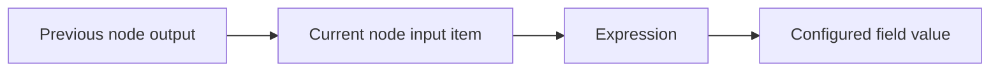

Expressions let you reference values from the current item, previous nodes, or linked items. Use them when a field needs dynamic text, a fallback, or a value nested inside an object.

For most workflows, start with the visual mapping UI. Use expressions when you need more control.

## Expression mental model



An expression is evaluated while the node runs. If the node runs for ten items, the expression is evaluated ten times, once for each current item.

## Current item values

Use the current input item when the value should come from the item being processed now.

```js
{{$input.item.json.title}}
```

If the current item is:

```json
{
  "title": "Pricing page",
  "url": "https://example.com/pricing"
}
```

the expression resolves to:

```txt
Pricing page
```

## Previous node values

Use a previous node reference when the value should come from a specific earlier step.

```js
{{$("Get Page Metadata").item.json.title}}
```

This follows item linking where possible, so the workflow uses the previous item related to the current item.

## Combine static text and dynamic values

Expressions are useful for prompts, messages, filenames, and API payloads.

```txt
Summarize the page at {{$input.item.json.url}}.
Title: {{$input.item.json.title}}
```

## Fallback values

When page data may be missing, include a fallback before passing values to an AI or integration node.

```js
{{$input.item.json.title || "Untitled page"}}
```

## Nested values

If a node returns nested output, reference the full path.

```js
{{$input.item.json.metadata.description}}
```

If the shape is uncertain, inspect the previous node output before writing the expression.

## Good expression habits

- Prefer clear field names from [Edit Fields](/nodes/builtin/datatransformation/editfields/) over long nested expressions.
- Keep expressions small. If logic grows, use the [Code](/nodes/builtin/core/code/) node.
- Add fallbacks for values extracted from browser pages.
- Test expressions with more than one item so item linking issues show up early.

## Related topics

- [Data structure](/usage/key-concepts/data/data-structure/)
- [Item linking](/usage/key-concepts/data/item-linking/)
- [Data mapping UI](/usage/key-concepts/data/data-mapping/data-mapping-ui/)
