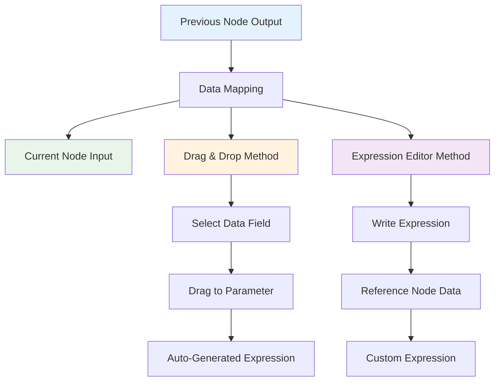
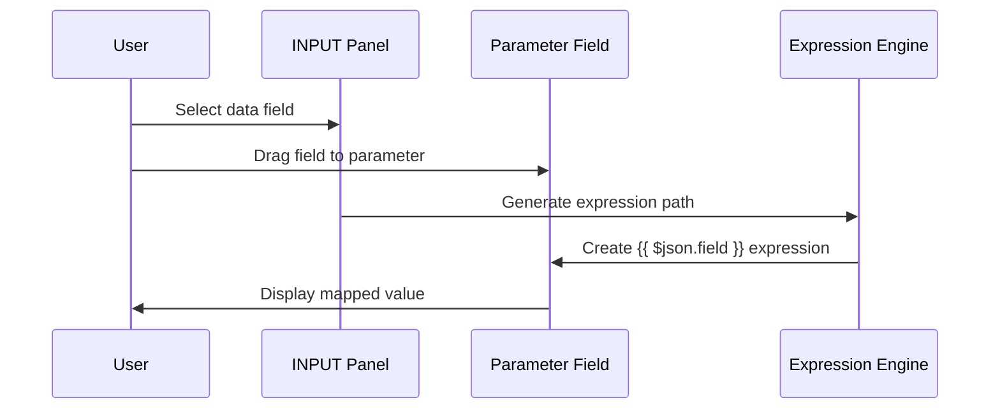

Data mapping means referencing data from previous nodes. It doesn't include changing (transforming) data, just referencing it.

## Data Mapping Process



You can map data in the following ways:

* Using the expressions editor.
* By dragging and dropping data from the **INPUT** into parameters. This generates the expression for you.

For information on errors with mapping and linking items, refer to [Item linking errors](/data/data-mapping/data-item-linking/item-linking-errors.md).

## How to drag and drop data

1. Run your workflow to load data.
2. Open the node where you need to map data.
3. You can map in table, JSON, and schema view:
	* In table view: click and hold a table heading to map top level data, or a field in the table to map nested data.
	* In JSON view: click and hold a key.
	* In schema view: click and hold a key.
4. Drag the item into the field where you want to use the data.

### Understand what you're mapping with drag and drop



Data mapping maps the key path, and loads the key's value into the field. For example, given the following data:

```js
[
	{
		"fruit": "apples",
		"color": "green"
	}
]
```

You can map `fruit` by dragging and dropping **fruit** from the **INPUT** into the field where you want to use its value. This creates an expression, `{{ $json.fruit }}`. When the node iterates over input items, the value of the field becomes the value of `fruit` for each item.

### Understand nested data

Given the following data:

```js
[
  {
    "name": "First item",
    "nested": {
      "example-number-field": 1,
      "example-string-field": "apples"
    }
  },
  {
    "name": "Second item",
    "nested": {
      "example-number-field": 2,
      "example-string-field": "oranges"
    }
  }
]
```

`Agentic WorkFlow` displays it in table form like this:

