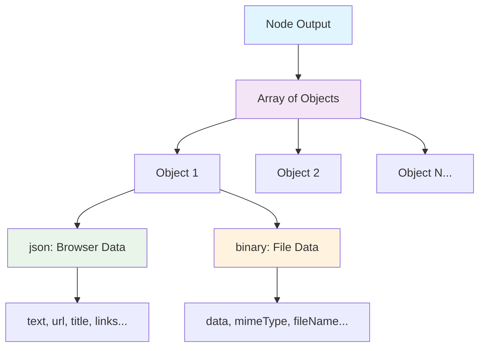
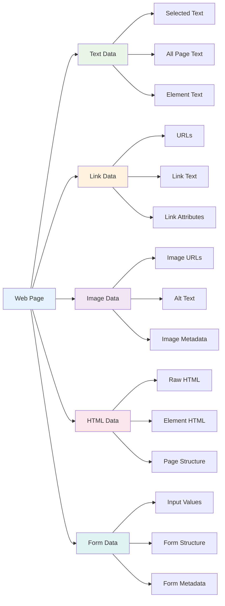

In Agentic Workflow Studio, all data passed between nodes is an array of objects. This structure is particularly important when working with browser context data.

## Data Structure Overview



The data structure has the following format:

```json
[
	{
		// For browser context data:
		// Wrap each item in another object, with the key 'json'
		"json": {
			// Example browser data
			"text": "Selected text from web page",
			"url": "https://example.com",
			"title": "Page Title",
			"links": [
				{"href": "https://example.com/page1", "text": "Link 1"},
				{"href": "https://example.com/page2", "text": "Link 2"}
			]
		},
		// For binary data (images, files):
		// Wrap each item in another object, with the key 'binary'
		"binary": {
			// Example image data from web page
			"page-screenshot": {
				"data": "....", // Base64 encoded binary data (required)
				"mimeType": "image/png", // Best practice to set if possible (optional)
				"fileExtension": "png", // Best practice to set if possible (optional)
				"fileName": "screenshot.png", // Best practice to set if possible (optional)
			}
		}
	},
]
```

/// note | Browser context data handling
Browser extension nodes automatically format extracted data into the proper structure. When using Code nodes to process browser data, Agentic Workflow Studio automatically adds the `json` key if it's missing and wraps items in an array as needed.
///

## Browser Data Types

Browser extension nodes extract different types of data from web pages:



- **Text data**: Selected text, all page text, or specific element text
- **Link data**: URLs, link text, and link attributes
- **Image data**: Image URLs, alt text, and image metadata
- **HTML data**: Raw HTML content from selected elements or entire pages
- **Form data**: Input values, form structure, and form metadata
## Data item processing

--8<-- "_snippets/flow-logic/data-flow-nodes.md"


