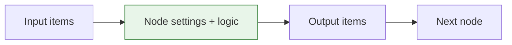
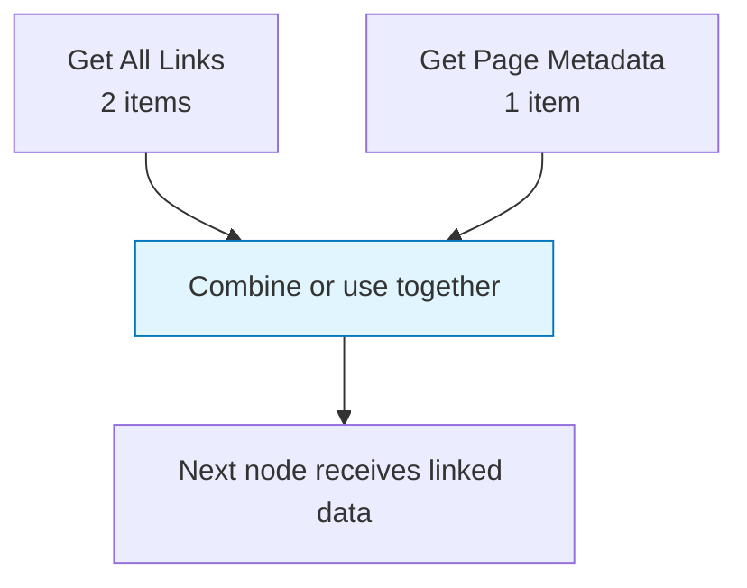

Most workflow problems are data-shape problems. A node may be working correctly, but the next node cannot use the result because the value is nested in a different field, because there are many items instead of one, or because two branches are combined differently than expected.

This page explains the mental model to use before reaching for expressions or custom code.

## The basic unit: an item

Agentic WorkFlow passes data as **items**. An item is one JSON-like object with named fields.

```json
{
  "title": "Quarterly report",
  "url": "https://example.com/report",
  "summary": "Revenue increased across three regions."
}
```

Most nodes receive a list of items and return a new list of items. A list can contain one item, many items, or no items.

```json
[
  { "title": "Page A", "url": "https://example.com/a" },
  { "title": "Page B", "url": "https://example.com/b" }
]
```

When a downstream node receives two items, it usually runs once for each item. That is why a workflow that starts with ten links can produce ten HTTP requests, ten AI summaries, or ten rows in an integration.

## Fields are contracts

Every node has a simple contract:



The next node does not know what you meant. It only sees field names and values. If the previous node returns `pageText` but the next node expects `text`, you must map or rename the field.

Use [Edit Fields](/nodes/builtin/datatransformation/editfields/) when you need to create, rename, or reshape fields. Use [Pick Field](/nodes/builtin/datatransformation/pickfield/) when you want to pass only a smaller part of the item forward.

## One item vs many items

The most important question is: **how many items does this node output?**

| Output shape | What it means | Common example |
| --- | --- | --- |
| One item | The workflow has one record to continue with | A page screenshot result |
| Many items | The next node repeats for each record | A list of links or images |
| Empty list | Nothing continues on that branch | A filter removed every item |
| Nested data | One item contains an array or object inside it | A response with `items: [...]` |

Nested arrays are not the same thing as multiple workflow items. If a node returns `{ "links": [...] }`, the next node receives one item with a `links` field. If it returns `[{ "url": "..." }, { "url": "..." }]`, the next node receives two items.

## Branches and combined input

When a node has multiple incoming connections, Agentic WorkFlow keeps the data from each parent separate so the downstream node can tell where each value came from.



If one branch produces two items and another produces one item, the downstream step may need to pair them, merge them, or choose one side as the source of truth. Use [Merge](/nodes/builtin/flow/merge/) when you want explicit control over how branches are combined.

## Inspect before you map

Before writing an expression, inspect the previous node output and answer these questions:

1. Is the value on the current item or inside a nested object?
2. Is there one item or many items?
3. Does each item have the same fields?
4. Did the data come from one parent node or multiple parent nodes?
5. Should the next node repeat per item, or should the list be combined first?

## Related topics

- [Item linking and mapping](/usage/key-concepts/data/item-linking/)
- [Data mapping UI](/usage/key-concepts/data/data-mapping/data-mapping-ui/)
- [Expressions](/usage/key-concepts/data/data-mapping/data-mapping-expressions/)
- [Merge](/nodes/builtin/flow/merge/)
