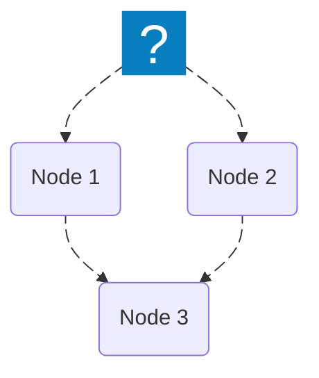

import { Image } from "astro:assets";
import Social from "@images/social.webp";

<Image src={Social} alt="Data structure illustration" />

All workflows in **Agentic WorkFlow** move data between nodes in a consistent, structured way.  
Understanding this helps you connect nodes correctly and predict how your data will look at each step.

---

## How data flows between nodes

Every node in a workflow **receives data**, processes it, and **outputs data** for the next node.

Each piece of data passed between nodes is stored as an **object**, and when multiple pieces of data exist, they’re stored as an **array of objects**.

```json
[
  {
    "name": "Alice",
    "email": "alice@example.com"
  },
  {
    "name": "Bob",
    "email": "bob@example.com"
  }
]
````

When a node processes multiple objects, it automatically **loops** over them, running its operation for each one.

---

## Multiple inputs and data merging

Some nodes can receive data from **more than one input**.
When this happens, Agentic WorkFlow combines the data into **all possible input combinations** (a “Cartesian product”).



If **Node 1** outputs *n* items and **Node 2** outputs *m* items,
then **Node 3** receives a total of **n × m** combined items.

---

## Example

| Node                    | Output                                                                                            |
| ----------------------- | ------------------------------------------------------------------------------------------------- |
| Node 1                  | `[{"id":1}, {"id":2}]`                                                                            |
| Node 2                  | `[{"color":"red"}, {"color":"blue"}]`                                                             |
| Node 3 (combined input) | `[{"Node 1": {"id":1}, "Node 2": {"color":"red"}}, {"Node 1": {"id":1}, "Node 2": {"color":"blue"}}, {"Node 1": {"id":2}, "Node 2": {"color":"red"}}, {"Node 1": {"id":2}, "Node 2": {"color":"blue"}}]` |

This combination makes it easy to test all possible data matches or merge information from multiple sources.

---

## Tips for building data-driven workflows

* Use **[Set nodes](/usage/key-concepts/data/set-nodes/)** to create or modify data structures.
* Use **[Merge nodes](/usage/key-concepts/data/merging/)** to combine outputs from multiple branches.
* Check your data at any step with the **Node preview panel** in the workflow editor.

---

## Related topics

* [Data types](/usage/key-concepts/data/data-types/)
* [Merge data sources](/usage/key-concepts/data/merging/)
* [Flow logic basics](/usage/key-concepts/flow-logic/)