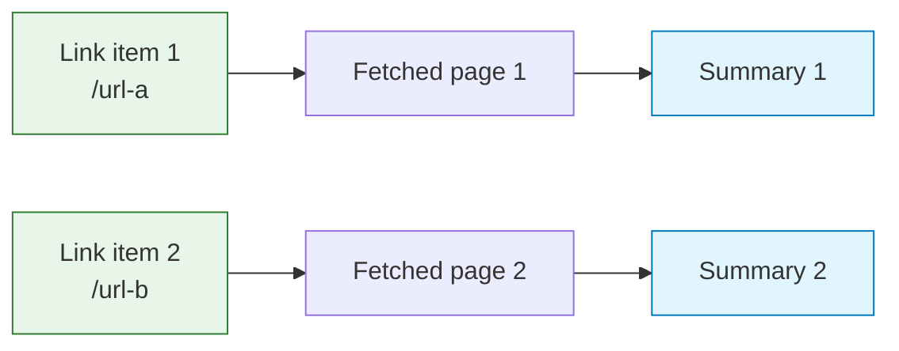
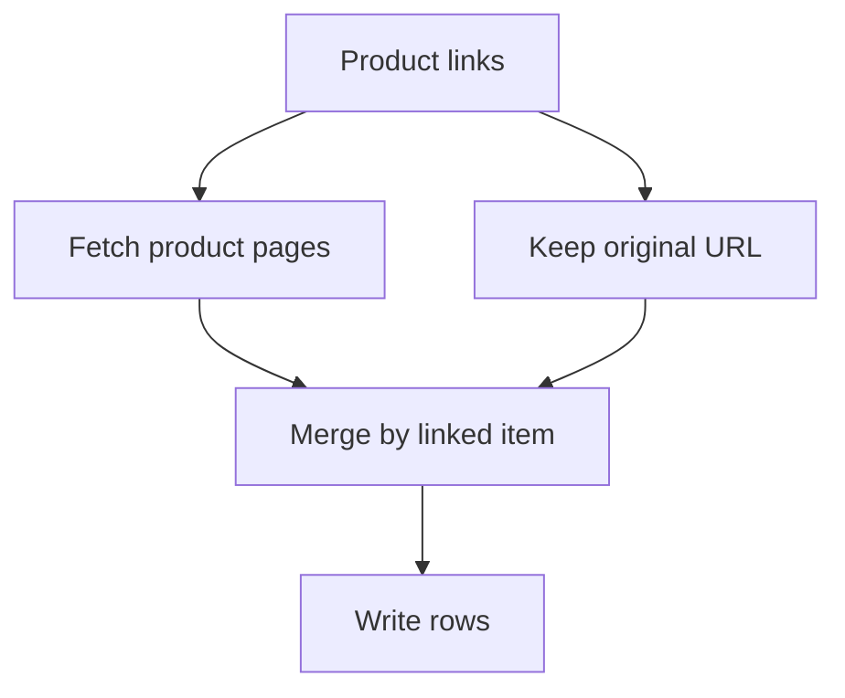

Item linking is how Agentic WorkFlow remembers which input item produced which output item. It matters whenever a workflow produces multiple records and later needs to refer back to the original record.

Without item linking, a workflow that extracts ten links, fetches ten pages, and summarizes ten pages would not know which summary belongs to which original link.

## The mental model

Each item carries a relationship to the item that created it.



When you map data from a previous node, Agentic WorkFlow uses that relationship to choose the matching item instead of grabbing a random row.

## Why it matters

Use item linking when you need to:

- Keep a page title with the URL it came from.
- Attach an AI summary to the original source record.
- Write one row per item into Google Sheets or Airtable.
- Combine extracted data with metadata from an earlier branch.

## Common mapping mistake

The most common mistake is treating a list like a single object.

```json
[
  { "url": "https://example.com/a", "title": "A" },
  { "url": "https://example.com/b", "title": "B" }
]
```

If the next node runs per item, map the current item field, such as `url`, not the whole list. If you really need the whole list at once, combine or reshape the data before the next step.

## Branches and related values

When two branches meet, decide whether values should be paired by position, merged by key, or kept separate.



If the relationship is not obvious, add a stable field such as `id`, `url`, or `sourceName` before splitting the workflow.

## Good habits

- Add stable IDs before branching.
- Rename fields to clear names before a merge.
- Preview output after any node that changes item count.
- Use [Edit Fields](/nodes/builtin/datatransformation/editfields/) to create clean downstream contracts.
- Use [Merge](/nodes/builtin/flow/merge/) when branches need explicit pairing.

## Related topics

- [Data structure](/usage/key-concepts/data/data-structure/)
- [Data mapping UI](/usage/key-concepts/data/data-mapping/data-mapping-ui/)
- [Expressions](/usage/key-concepts/data/data-mapping/data-mapping-expressions/)
