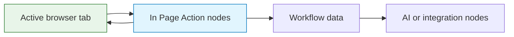
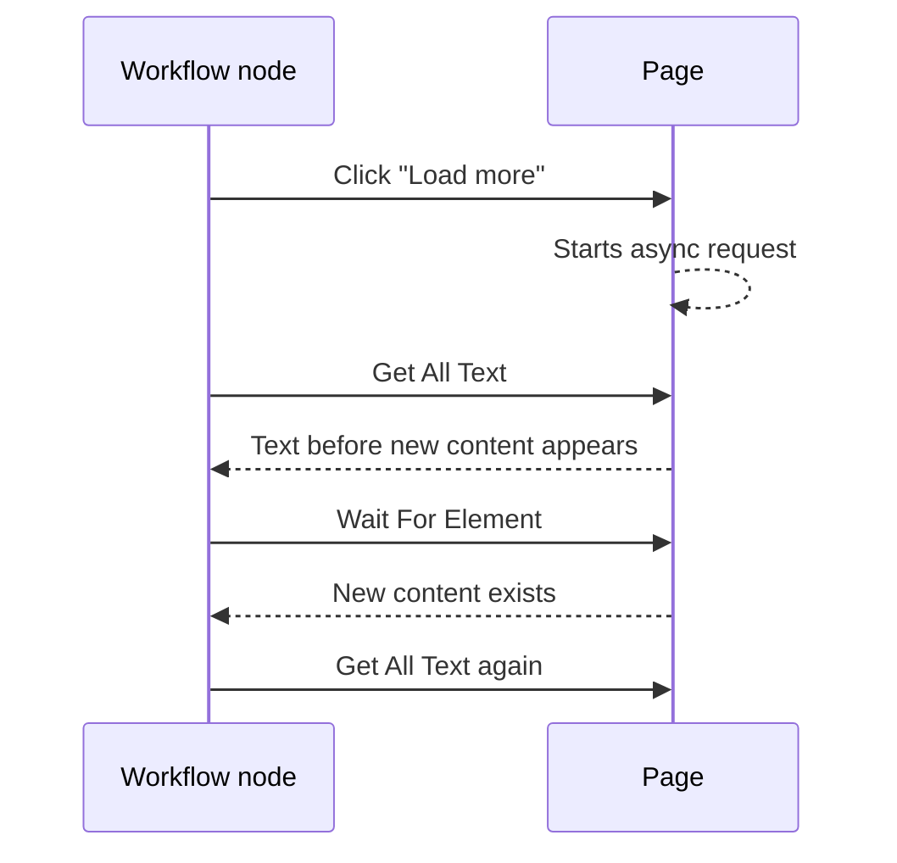

Agentic WorkFlow runs in the browser, so many workflows interact with a real page instead of a static data file. That gives workflows useful context, but it also means timing, permissions, and page state matter.

## What browser context includes

Browser context can include:

- The active tab URL.
- The current DOM.
- Selected text or selected HTML.
- Page metadata, links, images, forms, and accessibility information.
- User-visible state after clicks, form fills, navigation, and scrolling.

## Read actions vs write actions

Some nodes read the page. Others change it.

| Action type | Examples | Risk |
| --- | --- | --- |
| Read | Get All Text, Get All Links, Screenshot Page | Data may be missing if the page has not finished loading |
| Display | Display Markdown, Show Notification | Can add UI elements to the page |
| Manipulate | UI Automation, Form Fill, Delete UI Elements | Can change page state or trigger navigation |

After any write action, assume the page may need time before the next read.

## Timing is part of the workflow

Modern pages often update after the initial load. Content can appear after a network request, scroll, animation, or user interaction.

Use [Wait For Element](/nodes/extension/ui/wait-for-element/) when you know what should appear. Use [Wait](/nodes/builtin/flow/wait/) only when a fixed delay is good enough.

## Permissions and page limits

Browser automation depends on extension permissions and page restrictions. Some pages block scripts, isolate frames, or change markup often. Treat those as workflow constraints, not just errors.

## Practical checklist

- Confirm the workflow is running on the intended tab.
- Use selectors that target stable elements, not generated class names.
- Add waits after clicks, submissions, and navigation.
- Capture page text or HTML before passing it to AI.
- Avoid destructive UI manipulation unless the workflow purpose requires it.

## Related nodes

- [Get All Text](/nodes/extension/getalltext/)
- [Get Page Metadata](/nodes/extension/getpagemetadata/)
- [UI Automation](/nodes/extension/ui/automation/)
- [Form Fill](/nodes/extension/ui/form-fill/)
- [Wait For Element](/nodes/extension/ui/wait-for-element/)
