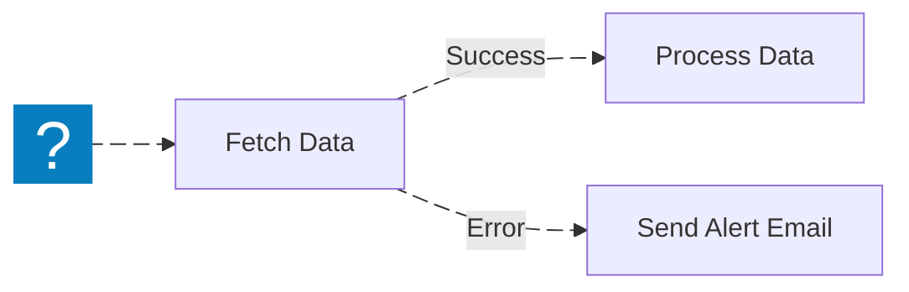

import { Image } from "astro:assets";
import Social from "@images/social.webp";
import { Card, CardGrid } from "@astrojs/starlight/components";

Sometimes a workflow step fails.

Examples:

- A website element doesn’t exist (button/text changed)
- A request times out
- A service rejects an API call

Error handling helps your workflow react instead of stopping immediately.

<Image src={Social} alt="illustration" />

---

## Common Workflow Errors

Here are some common error types you may encounter in browser automation or API workflows:

- **Content Security Policy (CSP) violations**: Some websites block actions from browser extensions.
- **DOM element not found**: When a webpage layout changes and selectors no longer match.
- **Cross-origin restrictions**: Accessing data from other domains may fail.
- **Page loading or timeout errors**: Slow network conditions or missing elements cause timeouts.
- **Permission errors**: Browser or API credentials may lack the necessary access rights.

---

## Create an Error Path

Each node can have an **error path** — a dedicated branch that runs when that node fails.  
This allows your workflow to handle issues intelligently, such as retrying, sending a notification, or logging the error.

For example:

In this example, if “Fetch Data” fails, the workflow continues through the error path to “Send Alert Email”.

Learn more about nodes in [Nodes](/usage/using-the-app/workflows/components/nodes/).

---

## Per-node error settings

Beyond an error path, each node has settings that control what happens when it fails:

- **Retry** — automatically re-run the node if it errors. Set how many times (**Max tries**) and how long to wait between attempts (**Wait between tries**). Good for flaky network calls; add a delay for rate-limited services.
- **Continue On Fail** — if the node still errors after any retries, log it and output a single empty item instead of stopping the workflow. Downstream nodes keep running. Use it for a step whose failure shouldn't sink the whole run.
- **Always Output Data** — emit an empty item when the output would otherwise be empty, so the workflow doesn't finish on this node just because it produced nothing.

Retry runs first; if it's exhausted, Continue On Fail decides whether the run stops or carries on.

## Best Practices for Error Handling

- **Use retries wisely**: Add delay or exponential backoff when retrying failed requests.
- **Log and monitor errors**: Capture context about failures for debugging.
- **Handle expected errors**: For example, use conditional nodes to catch known API failure responses.
- **Fail on purpose when needed**: if the workflow should stop with a clear message, use nodes like [Stop and Error](/nodes/builtin/flow/stopanderror/).

---

## Debugging Browser Workflows

If your browser-based workflow fails:

1. Open your **Execution History** in Agentic WorkFlow Studio.
2. Check the **Browser Console Logs** for JavaScript or network errors.
3. Verify that the target page still contains the same elements or structure.
4. Confirm that your extension permissions are correctly configured.

These steps can help identify whether the issue is with your workflow logic or external factors.
