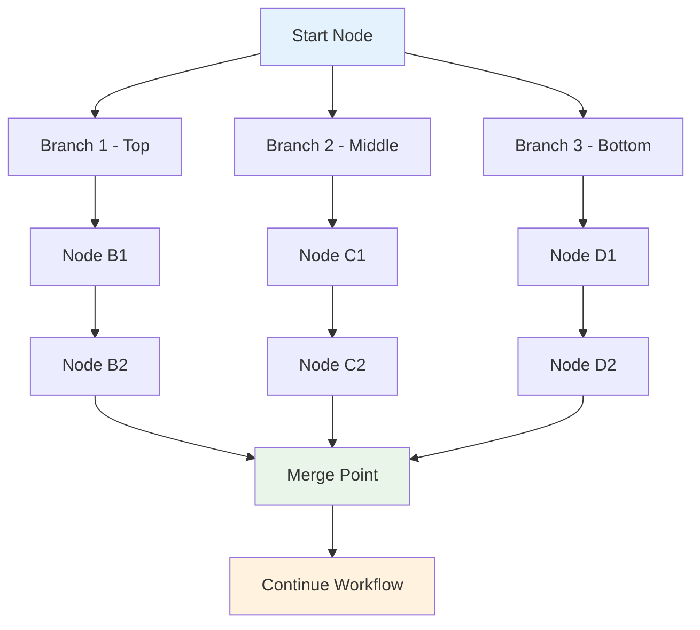

Agentic Workflow Studio executes each branch in turn, completing one branch before starting another. The browser extension orders branches based on their position on the canvas, from topmost to bottommost. If two branches are at the same height, the leftmost branch executes first.

## Execution Order Flow

**Execution Priority:**
1. **Vertical Position**: Top branches execute first
2. **Horizontal Position**: Left branches execute before right (when at same height)
3. **Sequential Processing**: Each branch completes fully before the next begins

This execution order is particularly important when working with browser context data, as some operations may affect the web page state or require specific timing.

## Browser Context Considerations

When designing multi-branch workflows that interact with web pages:

* **Page state changes**: Some browser extension nodes may modify the page (like scrolling or clicking), which could affect subsequent data extraction
* **Timing dependencies**: Certain browser operations may need to complete before others can access the updated page content
* **Resource limitations**: Browser environments have memory and processing constraints that may affect execution order

You can change the execution order in your workflow settings if needed for your specific browser automation requirements.

