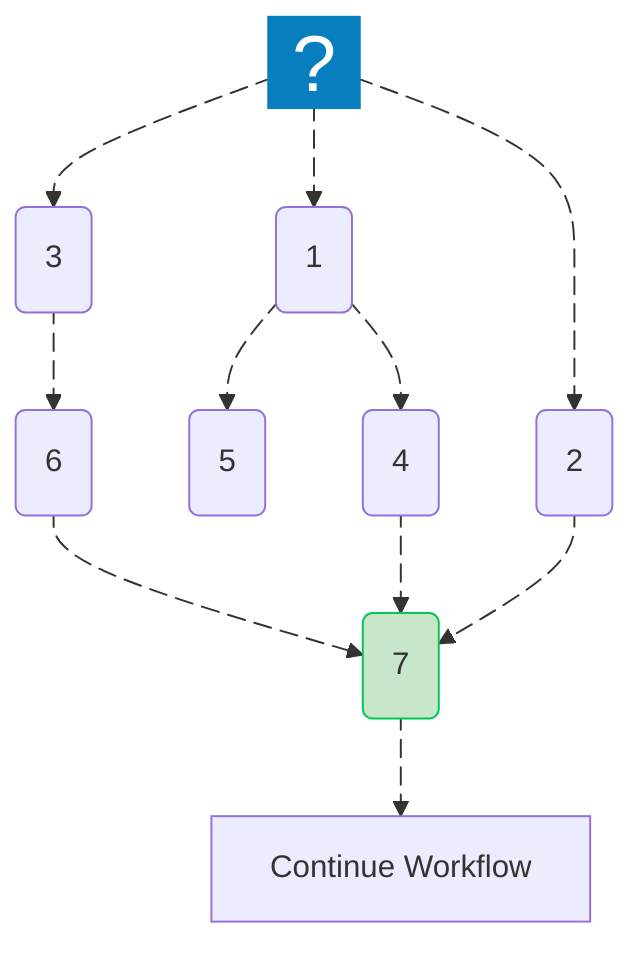

import { Image } from "astro:assets";
import Social from "@images/social.webp";

<Image src={Social} alt="Workflow execution order illustration" />

When you design a workflow, it's important to understand how **Agentic WorkFlow** decides the order in which nodes execute.  
This ensures your data moves correctly from one step to the next, especially in workflows with multiple branches.

---

## Execution overview

Agentic WorkFlow executes nodes using a **breadth-first search (BFS)** order.  
That means all nodes at the same level (connected to the same upstream node) are executed before moving deeper into the workflow chain.

```mermaid
flowchart TB
    B["Extract Data"] L_B_D_0@--> D["Transform Data"]
    C["Load Config"] L_C_D_0@--> D
    D L_D_E_0@--> E["Send Email"]
    n1[" "] L_n1_B_0@--> B & C

    B@{ shape: rounded}
    D@{ shape: rounded}
    C@{ shape: rounded}
    E@{ shape: rounded}
    n1@{ icon: "fa:circle-play", pos: "b"}
    style B fill:#E8F5E9
    style D fill:#E1F5FE
    style C fill:#FFF3E0
    style E fill:#E8EAF6

    L_B_D_0@{ animation: slow } 
    L_C_D_0@{ animation: slow } 
    L_D_E_0@{ animation: slow } 
    L_n1_B_0@{ animation: slow } 
    L_n1_C_0@{ animation: slow } 
````

### How this works

1. The workflow starts from the **trigger node**.
2. Agentic WorkFlow identifies all directly connected nodes and executes them one by one.
3. Once all first-level nodes finish, it proceeds to their connected nodes.
4. The process repeats until all reachable nodes complete execution.

---

## Execution priority

Each node waits for all its **predecessors** to finish before running.
If one of the required nodes fails or is skipped, dependent nodes won't execute until all prerequisites are completed.

This helps maintain **data consistency** across the workflow and prevents nodes from running with incomplete inputs.

---

## Example: multi-branch workflow

```mermaid
flowchart TB
    n2["Extract user data"] L_n2_n4_0@--> n4["Combine results"]
    n3["Fetch order history"] L_n3_n4_0@--> n4
    n4 L_n4_n5_0@--> n5["Send report"]
    n6[" "] L_n6_n2_0@--> n2 & n3

    n2@{ shape: rounded}
    n4@{ shape: rounded}
    n3@{ shape: rounded}
    n5@{ shape: rounded}
    n6@{ icon: "fa:circle-play", pos: "b"}
    style n4 stroke:#00C853,fill:#C8E6C9

    L_n2_n4_0@{ animation: slow } 
    L_n3_n4_0@{ animation: slow } 
    L_n4_n5_0@{ animation: slow } 
    L_n6_n2_0@{ animation: slow } 
    L_n6_n3_0@{ animation: slow } 


```

In this example:

* “Extract user data” and “Fetch order history” will firstly be executed (the order depends of the creation order).
* “Combine results” will wait for **both** branches to finish before running.
* “Send report” will only execute after “Combine results” completes.

---

### Example: complex multi-branch workflow



---

## Browser context considerations

When your workflow runs inside a browser environment, keep these factors in mind:

* **Page state changes**: Some nodes interact with a webpage (clicks, scrolls) — ensure timing is handled properly.
* **Timing dependencies**: Wait for page updates (e.g., after form submissions) before the next step.
* **Performance constraints**: Browser-based workflows have limited resources; plan execution to avoid heavy parallel operations.

---

## Related topics

* [Splitting workflows](/usage/key-concepts/flow-logic/splitting/)
* [Merging data streams](/usage/key-concepts/flow-logic/merging/)
* [Error handling](/usage/key-concepts/flow-logic/error-handling/)
* [Waiting and delays](/usage/key-concepts/flow-logic/waiting/)