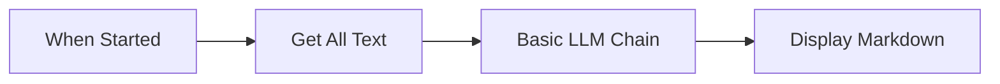
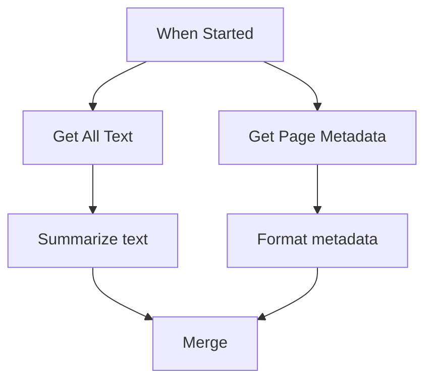
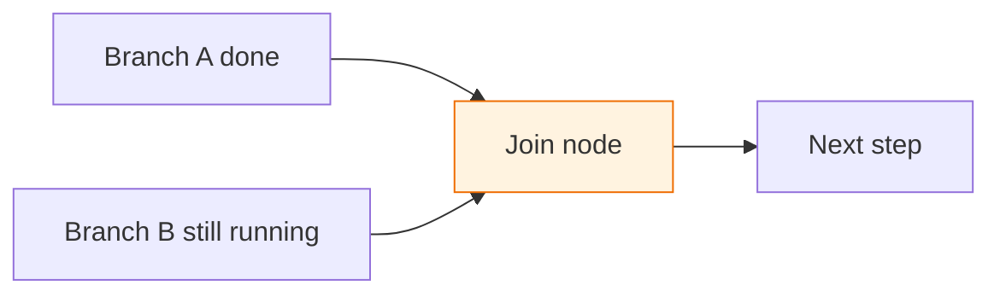
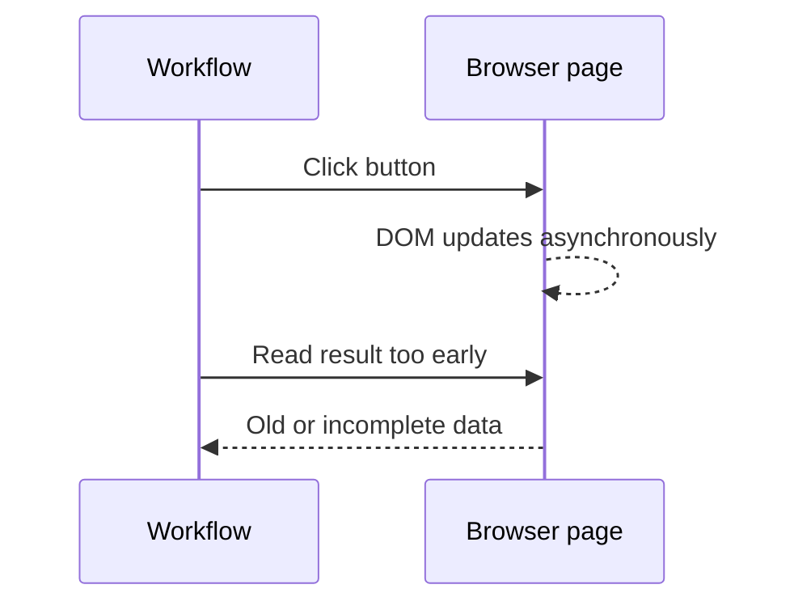

Execution order answers one question: **when is a node allowed to run?**

Agentic WorkFlow follows the connections in the workflow. A node can run after its required upstream nodes have finished and produced the data it needs. In simple workflows this feels linear. In branching workflows, it becomes important to understand waiting, joining, and page state.

## The simple case

This workflow runs from left to right. Each node receives the output of the previous node.

## Branches run independently

When one node connects to multiple downstream nodes, each branch can do its own work.

The text branch and metadata branch do not depend on each other. The merge step is the point where they must be brought back together.

## Join points wait for parents

A node with multiple incoming connections is a **join point**. It should not be treated like a normal single-input step. The node needs enough upstream context to decide what input it should use.

If the downstream step needs data from both branches, use [Merge](/nodes/builtin/flow/merge/) explicitly. If the downstream step only needs one branch, keep the connections separate to avoid accidental cross-input behavior.

## Reading a run variable before it is set

A [Set Variable](/nodes/builtin/flow/setvariable/) node stores a value that later nodes read as `{{ $run.name }}` (see [run variables](/usage/key-concepts/data/data-mapping/data-mapping-expressions/#run-variables--run)). Because the value only exists once the writer has run, a node that reads it must be **guaranteed to run after** the writer. The editor checks this at design time and warns you when it isn't sure:

- **Error** — no Set Variable node for that name can reach the reader at all. The variable would never be set when the read happens, so the run would fail.
- **Warning** — a writer _can_ reach the reader, but isn't guaranteed to have run first. This happens when the paths rejoin through a **Funnel**, which fires as soon as the first branch arrives — so the branch carrying the write may not have run yet.
- **No warning** — a writer is guaranteed to have run. An **AND-join** waits for every predecessor before firing, so a write on any incoming branch has definitely happened by the time the reader runs.

Plain **If** branches need no special handling: whichever branch is taken runs to completion before the nodes after it, so a variable set on the taken branch is available downstream.

## Browser actions are stateful

In-page actions do not just pass data. They can change the active page.

When a node clicks, submits, scrolls, or changes the page, add a [Wait](/nodes/builtin/flow/wait/) or [Wait For Element](/nodes/extension/ui/wait-for-element/) before reading the next page state.

## Practical rules

- Put data-producing nodes before data-consuming nodes.
- Use [Filter](/nodes/builtin/flow/filter/) before expensive steps like AI or external API calls.
- Use [Merge](/nodes/builtin/flow/merge/) when two branches must be joined intentionally.
- Use [Loop](/nodes/builtin/flow/loop/) when a branch should repeat until a condition is reached.
- Use [Stop and Error](/nodes/builtin/flow/stopanderror/) when continuing would create bad data.
- Add waits around browser actions that trigger page changes.

## Related topics

- [Workflow lifecycle](/usage/key-concepts/flow-logic/workflow-lifecycle/)
- [Splitting workflows](/usage/key-concepts/flow-logic/splitting/)
- [Merging data streams](/usage/key-concepts/flow-logic/merging/)
- [Waiting and delays](/usage/key-concepts/flow-logic/waiting/)
- [Error handling](/usage/key-concepts/flow-logic/error-handling/)
