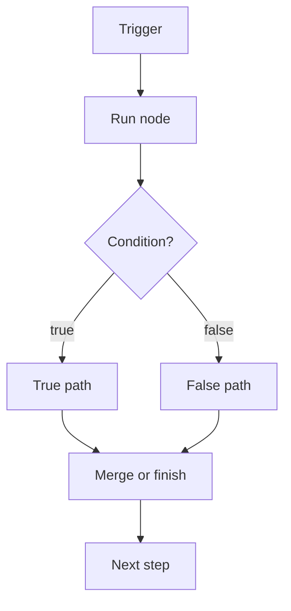

import { Card, CardGrid } from "@astrojs/starlight/components";

Flow logic decides **what runs next**. It is separate from data mapping: mapping changes the shape of data, while flow logic changes the path a run takes through the workflow.

## Core Ideas

<CardGrid>
  <Card title="Workflow Lifecycle" icon="refresh-cw">
    The full path from trigger, context, data, browser changes, output, and errors.

    [Read workflow lifecycle](/usage/key-concepts/flow-logic/workflow-lifecycle/)
  </Card>

  <Card title="Execution Order" icon="route">
    How nodes run, how branches are selected, and why in-page actions can change later results.

    [Read execution order](/usage/key-concepts/flow-logic/execution-order/)
  </Card>

  <Card title="Branches And Merges" icon="git-merge">
    Use splitting, conditions, and merging to keep workflow paths understandable.

    [Read splitting](/usage/key-concepts/flow-logic/splitting/)
  </Card>

  <Card title="Loops And Waiting" icon="repeat">
    Repeat work over many items and wait for page or time-based conditions before continuing.

    [Read looping](/usage/key-concepts/flow-logic/looping/)
  </Card>
</CardGrid>

## Practical Rule

Keep browser actions, flow decisions, and data transformations visually separate when possible. That makes it much easier to find whether a failure came from page timing, an incorrect condition, a missing field, or an external service.
