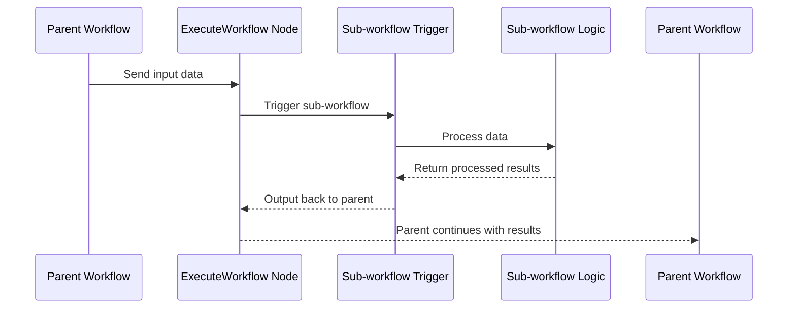

import { Card, CardGrid } from "@astrojs/starlight/components";
import { Image } from "astro:assets";
import Social from "@images/social.webp";

Sometimes you’ll want to reuse the same set of steps in multiple workflows.

Modular (lambda) workflows let one workflow **run another workflow**.

This helps you:

- Keep workflows smaller and easier to understand
- Reuse the same “module” in multiple places
- Update the module once instead of updating many workflows

---

## Why use modular (lambda) workflows

- Reuse logic across different workflows: for example, a “Normalize Data” or “Send Report” module.
- Keep individual workflows smaller, faster, and easier to maintain.
- Update a sub-workflow once and have multiple parent workflows benefit automatically.

---

## How it works

### Step 1: Create the reusable workflow

- Create a new workflow to act as a reusable piece.
- Set it up to accept input from another workflow.
- Build the internal logic, test and save the sub-workflow.

### Step 2: Call it from a parent workflow

- In the parent workflow, add a node that calls the other workflow.
- Choose which workflow to run.
- Pass in the data you want the sub-workflow to process.
- Use the output as the input for the next step.

Node reference: [Lambda Workflow](/nodes/builtin/lambda/lambdaworkflow/).

### How data passes between workflows

In this sequence:

- The parent workflow sends data into the sub-workflow trigger.
- The sub-workflow processes data and returns output.
- The parent workflow resumes with the returned output.
  To keep things predictable, decide what input fields the sub-workflow expects and what output it returns.

<Image src={Social} alt="Illustration of parent-sub-workflow relationship" />

---

## Best practices

- Name sub-workflows descriptively (e.g., **Normalize Data**, **Send Monthly Report**).
- Document inputs and outputs: use Sticky Notes (see [Sticky Notes](/usage/using-the-app/workflows/components/sticky-notes/)) on your workflows.
- After import or copy of workflows, test parent workflows to confirm integration.
- Avoid circular calls (Workflow A calls B, and B calls A) unless intentionally designed.
- Keep sub-workflows focused on **one task** only: modular and reusable logic is easier to track and maintain.

---

## When not to use modular workflows

- The logic is very simple and used only once—modularizing may add unnecessary overhead.
- Interdependencies between actions are tightly coupled and harder to break out.
- Latency is a concern: if the parent must wait for a sub workflow that takes long, reconsider splitting.
  In such cases, you may prefer simpler patterns like [Splitting workflows](/usage/key-concepts/flow-logic/splitting/) or [Looping & Iteration](/usage/key-concepts/flow-logic/looping/).
