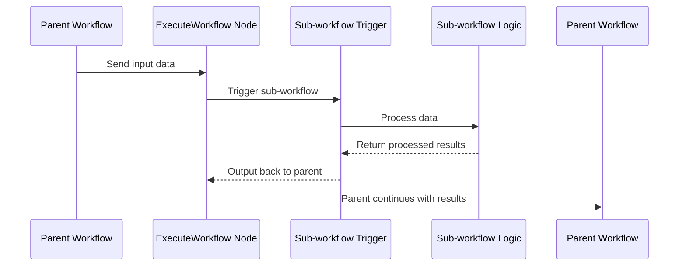

import { Card, CardGrid } from "@astrojs/starlight/components";
import { Image } from "astro:assets";
import Social from "@images/social.webp";

In Agentic Workflow Studio you can have one workflow **call another workflow**—creating modular, reusable components of automation.  
This helps you break large automations into smaller pieces, reuse logic, and keep workflows easier to manage.  
(This aligns with the sub-workflow concept from [n8n docs](https://docs.n8n.io/flow-logic/subworkflows/?utm_source=chatgpt.com))

---

## Why use modular (lambda) workflows

- Reuse logic across different workflows: for example, a “Normalize Data” or “Send Report” module.
- Keep individual workflows smaller, faster, and easier to maintain.
- Update a sub-workflow once and have multiple parent workflows benefit automatically.

---

## How it works

### Step 1: Create the sub-workflow

- Create a new workflow to act as a reusable piece.
- At the start of it, include an **Execute Sub-workflow Trigger** node (also called “When executed by another workflow”).
- Define its input fields or structure in the trigger configuration.
- Build the internal logic, test and save the sub-workflow.

### Step 2: Call the sub-workflow from a parent workflow

- In the parent workflow, use the **Execute Workflow** (or “Execute Sub-workflow”) node.
- Select the workflow to call (or reference it via an ID or URL).
- Map input data from the parent into the sub-workflow’s input format.
- Configure whether the parent waits for a result or continues asynchronously.

### How data passes between workflows

In this sequence:

- The parent workflow sends data into the sub-workflow trigger.
- The sub-workflow processes data and returns output.
- The parent workflow resumes with the returned output.
  This ensures you can define clear **input** and **output** formats via the “Lambda Input” (trigger) and “Lambda Output” (last step) nodes, making modules predictable and reusable.

<Image src={Social} alt="Illustration of parent-sub-workflow relationship" />

---

## Best practices

- Name sub-workflows descriptively (e.g., **Normalize Data**, **Send Monthly Report**).
- Document inputs and outputs: use Sticky Notes (see [Sticky Notes](/usage/using-the-app/workflows/components/sticky-notes/)) on your workflows.
- After import or copy of workflows, test parent workflows to confirm integration.
- Avoid circular calls (Workflow A calls B, and B calls A) unless intentionally designed.
- Keep sub-workflows focused on **one task** only: modular and reusable logic is easier to track and maintain.

---

## When not to use modular workflows

- The logic is very simple and used only once—modularizing may add unnecessary overhead.
- Interdependencies between actions are tightly coupled and harder to break out.
- Latency is a concern: if the parent must wait for a sub workflow that takes long, reconsider splitting.
  In such cases, you may prefer simpler patterns like [Splitting workflows](/usage/key-concepts/flow-logic/splitting/) or [Looping & Iteration](/usage/key-concepts/flow-logic/looping/).
