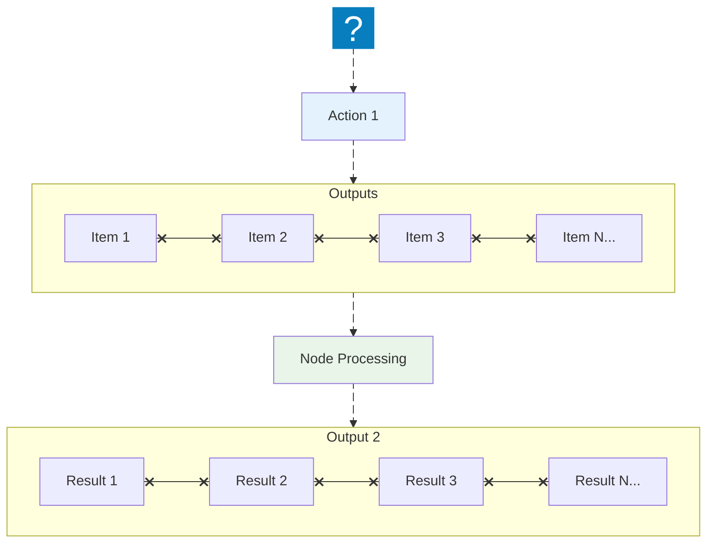
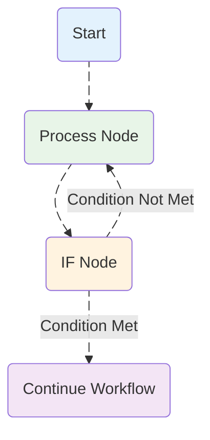

Looping is useful when you want to process multiple items or perform an action repeatedly, such as sending a message to every contact in your address book. `Agentic WorkFlow` handles this repetitive processing automatically, meaning you don't need to specifically build loops into your workflows.

## Using loops in `Agentic WorkFlow`

`Agentic WorkFlow` nodes take any number of items as input, process these items, and output the results. You can think of each item as a single data point, or a single row in the output table of a node.

Nodes usually run once for each item. 

### Executing nodes once

:::caution
Coming soon
:::

## Creating loops

`Agentic WorkFlow` typically handles the iteration for all incoming items. However, there are certain scenarios where you will have to create a loop to iterate through all items. Refer to [Node exceptions](#node-exceptions) for a list of nodes that don't automatically iterate over all incoming items.

### Loop until a condition is met

To create a loop in an `Agentic WorkFlow` workflow, connect the output of one node to the input of a previous node. Add an [IF](/nodes/builtin/core/flow/if) node to check when to stop the loop.

### Loop until all items are processed

:::caution
Coming soon
:::