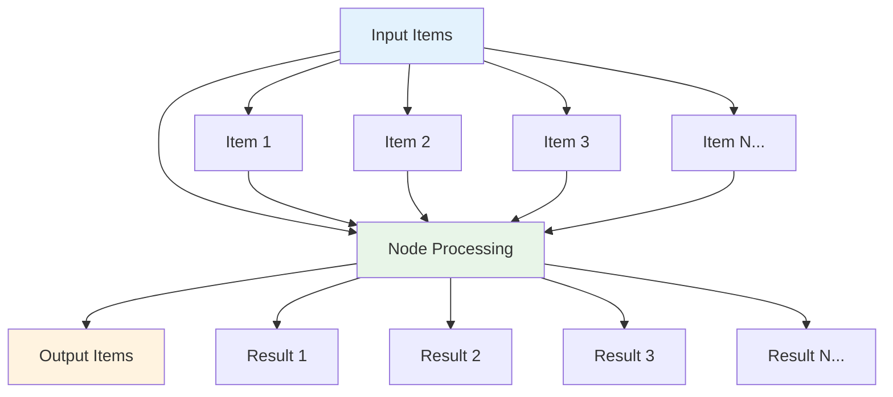
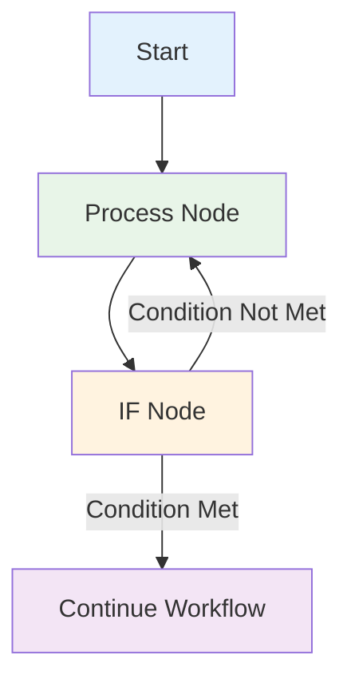

Looping is useful when you want to process multiple items or perform an action repeatedly, such as sending a message to every contact in your address book. `Agentic WorkFlow` handles this repetitive processing automatically, meaning you don't need to specifically build loops into your workflows.

## Using loops in `Agentic WorkFlow`

`Agentic WorkFlow` nodes take any number of items as input, process these items, and output the results. You can think of each item as a single data point, or a single row in the output table of a node.

Nodes usually run once for each item. For example, if you wanted to send the name and notes of the customers in the Customer Datastore node as a message on Slack, you would:

1. Connect the Slack node to the Customer Datastore node.
2. Configure the parameters.
3. Execute the node.

You would receive five messages: one for each item.

This is how you can process multiple items without having to explicitly connect nodes in a loop.

### Executing nodes once

:::caution
Coming soon
:::

## Creating loops

`Agentic WorkFlow` typically handles the iteration for all incoming items. However, there are certain scenarios where you will have to create a loop to iterate through all items. Refer to [Node exceptions](#node-exceptions) for a list of nodes that don't automatically iterate over all incoming items.

### Loop until a condition is met

To create a loop in an `Agentic WorkFlow` workflow, connect the output of one node to the input of a previous node. Add an [IF](/integrations/builtin/core-nodes/`Agentic WorkFlow`-nodes-base.if.md) node to check when to stop the loop.

Here is an [exampl`Agentic WorkFlow`orkflow](https://`Agentic WorkFlow`/workflows/1130) that implements a loop with an `IF` node:

### Loop until all items are processed

Use the [Loop Over Items](/integrations/builtin/core-nodes/`Agentic WorkFlow`-nodes-base.splitinbatches.md) node when you want to loop until all items are processed. To process each item individually, set **Batch Size** to `1`.

You can batch the data in groups and process these batches. This approach is useful for avoiding API rate limits when processing large incoming data or when you want to process a specific group of returned items.

The Loop Over Items node stops executing after all the incoming items get divided into batches and passed on to the next node in the workflow so it's not necessary to add an IF node to stop the loop.