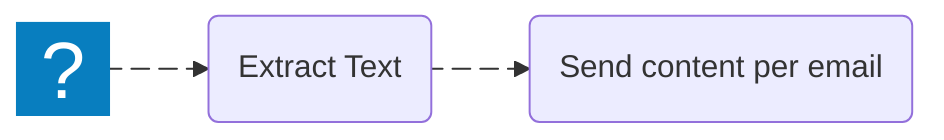

Splitting means taking one workflow path and turning it into multiple paths.

The most common way to split is with an **If** node.

It lets your workflow do different things depending on a condition (for example: “is this text longer than 500 characters?”).

Compare these workflows:

This is the basic idea: one input → different actions depending on what you find.

See the node reference: [If](/nodes/builtin/flow/If/).
