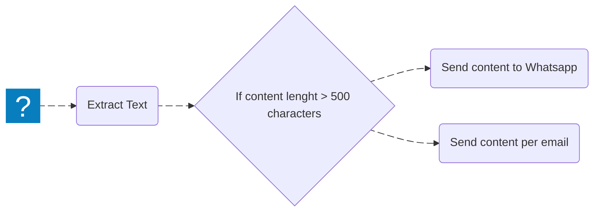

Splitting uses the [IF](/nodes/builtin/core-nodes/if) or [Switch](/nodes/builtin/core-nodes/switch) nodes. It turns a single-branch workflow into a multi-branch workflow. This is a key piece of representing complex logic in `Agentic WorkFlow`.

Compare these workflows:

This is the power of splitting and conditional nodes in `Agentic WorkFlow`.

Refer to the [IF](/nodes/builtin/core-nodes/if) or [Switch](/nodes/builtin/core-nodes/switch) documentation for usage details.
