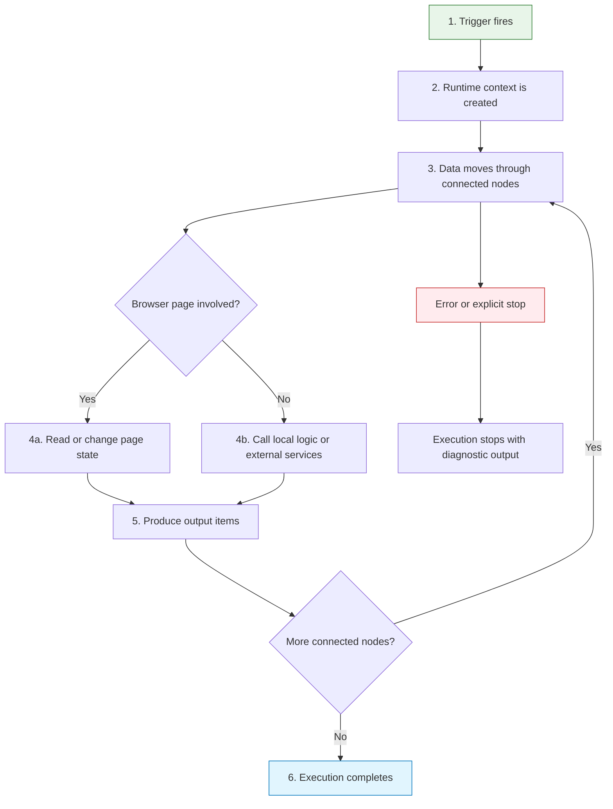

A workflow is more than a chain of nodes. It has a lifecycle: it starts from an event, prepares context, moves data through nodes, handles browser state, and either completes or stops with an error.

Understanding that lifecycle makes complex workflows easier to debug.

## Lifecycle overview

## 1. Trigger fires

The trigger decides why the workflow starts. A manual trigger starts when you run it. A schedule trigger starts from time. Browser triggers can start from page load, context menu, or startup events.

Start by choosing the trigger that matches the user moment you want to automate.

## 2. Runtime context is created

The workflow receives context such as trigger data, selected text, current page state, or the scheduled execution time. Not every trigger provides the same context, so downstream nodes should only depend on context that the trigger actually supplies.

## 3. Data moves through nodes

Each node receives input items, applies settings, and returns output items. If a node outputs multiple items, downstream work usually repeats for each item.

## 4. Browser state may change

In Page Action nodes can read or modify the active tab. Browser state is not static:

- A click can trigger asynchronous DOM changes.
- A form submit can navigate the page.
- Lazy-loaded content may appear after scrolling.
- The selected text can change if the user interacts with the page.

Use [Wait For Element](/nodes/extension/ui/wait-for-element/) or [Wait](/nodes/builtin/flow/wait/) when the next node depends on a page update.

## 5. Output becomes the next input

The output of one node becomes the input contract for the next node. This is where most workflow bugs happen: missing fields, unexpected lists, stale page state, or mismatched branch data.

## 6. Completion or stop

A workflow completes when there are no more reachable nodes. It stops early when a node fails or when [Stop and Error](/nodes/builtin/flow/stopanderror/) is used intentionally.

A run can also **pause indefinitely awaiting a human decision** via [Wait For Approval](/nodes/builtin/flow/wait-for-approval/), rather than completing or stopping outright. The run parks in the Executions pane until it is approved or rejected — resuming from where it paused — or is cancelled there.

## Debugging by lifecycle stage

| Symptom | Stage to inspect | Likely fix |
| --- | --- | --- |
| Workflow never starts | Trigger | Check trigger type and permissions |
| Node receives empty input | Data movement | Inspect previous node output |
| Browser action happens too early | Browser state | Add wait or wait for element |
| AI answer lacks context | Data contract | Pass the extracted text or retrieval result explicitly |
| Integration writes wrong rows | Item linking | Add stable IDs and merge intentionally |
| Run seems stuck, never finishes | Completion or stop | Check the Executions pane for a run paused on [Wait For Approval](/nodes/builtin/flow/wait-for-approval/) awaiting approve/reject |

## Related topics

- [Execution order](/usage/key-concepts/flow-logic/execution-order/)
- [Data structure](/usage/key-concepts/data/data-structure/)
- [Browser context](/usage/key-concepts/flow-logic/browser-context/)
- [Error handling](/usage/key-concepts/flow-logic/error-handling/)
