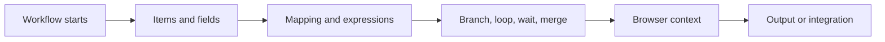

import { Card, CardGrid } from "@astrojs/starlight/components";

Key concepts explain how workflows behave underneath the visual canvas. Use this section when a workflow runs but the result is confusing: data is missing, a branch takes the wrong path, a browser action reads the wrong page state, or an AI step receives the wrong context.

## Concept Map

<CardGrid>
  <Card title="Data Structure" icon="list-tree">
    Learn how nodes pass items, fields, arrays, and objects between steps.

    [Read data structure](/usage/key-concepts/data/data-structure/)
  </Card>

  <Card title="Item Linking" icon="link">
    Understand how records keep their relationship as they move through mappings, branches, loops, and merges.

    [Read item linking](/usage/key-concepts/data/item-linking/)
  </Card>

  <Card title="Execution Order" icon="route">
    See how the workflow engine decides which node runs next and why browser state matters.

    [Read execution order](/usage/key-concepts/flow-logic/execution-order/)
  </Card>

  <Card title="Browser Context" icon="laptop">
    Learn what page, tab, selected text, DOM state, and permissions a browser action depends on.

    [Read browser context](/usage/key-concepts/flow-logic/browser-context/)
  </Card>
</CardGrid>

## How To Use This Section

Start with [Workflow Lifecycle](/usage/key-concepts/flow-logic/workflow-lifecycle/) if you want the full mental model. Move to [Data Structure](/usage/key-concepts/data/data-structure/) when mappings are unclear, and use [Flow Logic](/usage/key-concepts/flow-logic/) when branching, loops, waiting, or merging behave unexpectedly.

For exact settings and outputs, use the [Node Reference](/nodes/) after you understand the concept.
