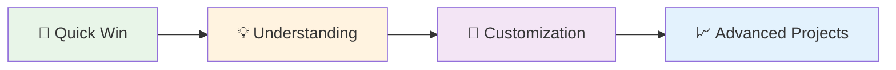

# 🚀 Quick Wins

Get up and running with Agentic Workflow Studio in minutes, not hours. These focused tutorials show you how to solve real problems quickly and build confidence with the platform.

## Why Start Here?

- **Immediate Results**: See value in your first 5 minutes
- **Real Problems**: Solve actual business challenges, not toy examples  
- **Build Confidence**: Success breeds success - start with wins
- **Learn by Doing**: Hands-on tutorials with copy-paste workflows

## Available Quick Wins

### 🛒 E-commerce & Shopping

**[Extract Product Prices](extract-product-prices)**  
*5 minutes • 🌱 Beginner*

Automatically collect product prices from any shopping website. Perfect for price comparison and market research.

**What you'll learn**: Web scraping basics, data extraction, workflow building

**[Monitor Competitor Prices](monitor-competitor-prices)**  
*15 minutes • 🚀 Intermediate*

Set up automated competitor price tracking with alerts. Stay ahead of market changes without manual checking.

**What you'll learn**: Automated monitoring, price comparison, alert systems

### ⚡ Productivity & Automation

**[Automate Form Filling](automate-form-filling)**  
*10 minutes • 🌱 Beginner*

Speed up repetitive data entry by automatically filling web forms with your information.

**What you'll learn**: Form automation, data mapping, browser interaction

## How to Use Quick Wins

1. **Pick Your Challenge**: Choose a tutorial that matches a real problem you face
2. **Follow Step-by-Step**: Each tutorial includes screenshots and clear instructions
3. **Copy-Paste Ready**: Use provided workflow configurations to get started instantly
4. **Customize & Expand**: Adapt the examples to your specific needs

## Success Path

**Recommended Learning Path:**
1. Start with **Extract Product Prices** to learn the basics
2. Try **Automate Form Filling** to understand browser interaction
3. Build **Monitor Competitor Prices** for automated workflows
4. Move to [How-To Guides](/usage/how-to/) for complete projects

## What's Next?

Once you've completed a few Quick Wins, you're ready for more comprehensive projects:

- **[How-To Guides](/usage/how-to/)** - Complete project tutorials (30-60 minutes)
- **[Learning Courses](/learning/)** - Structured learning paths by skill level
- **[Advanced AI](/advanced-ai/)** - AI-powered workflow creation

## Need Help?

- **Stuck on a step?** Check the troubleshooting section in each tutorial
- **Want to customize?** Each tutorial includes modification tips
- **Ready for more?** Follow the "What's Next?" links in each guide

---

**💡 Remember**: The goal is progress, not perfection. Start with one Quick Win and build from there!