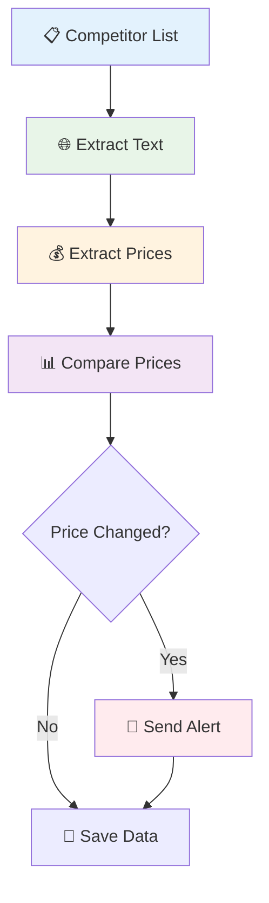

# Monitor Competitor Prices

## What You'll Build

Create an automated system that tracks competitor prices across multiple websites and alerts you to changes, helping you stay competitive in the market.

**⏱️ Time**: 15 minutes  
**🎯 Difficulty**: Intermediate  
**✅ Result**: Automated price monitoring system with alerts

## Why This Matters

- **Stay Competitive**: React quickly to competitor price changes
- **Maximize Profits**: Optimize your pricing strategy with real-time data
- **Save Research Time**: Automated monitoring instead of manual checking
- **Spot Trends**: Identify pricing patterns and market movements

## What Goes In, What Comes Out

| Input | Output |
|-------|--------|
| List of competitor URLs | Price comparison report |
| Your current prices | Price change alerts |
| Monitoring schedule | Historical price data |

**Example**: 10 competitor products → Daily price report + instant alerts

## Step-by-Step Guide

### Step 1: Set Up Your Monitoring List

Create a list of competitor products to track:

```json
{
  "competitors": [
    {
      "name": "Competitor A",
      "product": "Laptop Pro",
      "url": "https://competitor-a.com/laptop-pro",
      "your_price": 1299.99
    },
    {
      "name": "Competitor B", 
      "product": "Laptop Pro",
      "url": "https://competitor-b.com/laptop-pro",
      "your_price": 1299.99
    }
  ]
}
```

### Step 2: Build Price Extraction Workflow

Set up these nodes in sequence:
- **Lambda Input** (competitor URLs)
- **Get All Text From Link** (extract page content)
- **Edit Fields** (extract and clean prices)
- **Merge** (combine all price data)
- **Download as File** (save results)



### Step 3: Configure Price Extraction

**Get All Text From Link Settings:**
```json
{
  "textFilters": [".navigation", ".footer", ".reviews", ".ads"],
  "waitForLoad": true,
  "timeout": 20000
}
```

**Edit Fields for Price Extraction:**
```json
{
  "operations": [
    {
      "field": "text",
      "operation": "extract_regex",
      "pattern": "\\$[0-9,]+\\.?[0-9]*",
      "output_field": "current_price"
    },
    {
      "field": "current_price",
      "operation": "clean_currency",
      "output_field": "price_numeric"
    }
  ]
}
```

**✅ You should see**: Clean price data for each competitor

### Step 4: Set Up Price Comparison

**Price Analysis Logic:**
```json
{
  "comparison_rules": [
    {
      "condition": "competitor_price < your_price * 0.95",
      "alert": "Competitor undercut by 5%+",
      "action": "immediate_alert"
    },
    {
      "condition": "competitor_price > your_price * 1.1", 
      "alert": "Opportunity to raise prices",
      "action": "weekly_report"
    }
  ]
}
```

### Step 5: Automate Monitoring Schedule

**Scheduling Options:**
- **Hourly**: For fast-moving markets
- **Daily**: For standard monitoring  
- **Weekly**: For stable markets

## Real-World Example

**Business**: Electronics retailer  
**Monitoring**: 25 laptop models across 5 competitors  
**Frequency**: Twice daily  
**Result**: 15% increase in competitive positioning

**Alert Example:**
> 🚨 **Price Alert**: Competitor A dropped MacBook Pro to $1,199 (was $1,299)  
> Your price: $1,289 | Recommended action: Consider price adjustment

## Advanced Features

### Price History Tracking
```json
{
  "price_history": {
    "product_id": "laptop-pro",
    "dates": ["2024-01-01", "2024-01-02"],
    "prices": [1299.99, 1249.99],
    "trend": "decreasing"
  }
}
```

### Multi-Site Comparison
- Track same product across multiple retailers
- Identify lowest market price
- Monitor price spread and positioning

### Alert Customization
- **Immediate**: SMS/email for significant changes
- **Daily**: Summary report of all changes
- **Weekly**: Trend analysis and recommendations

## Troubleshooting

| Problem | Solution |
|---------|----------|
| Prices not extracted | Adjust regex pattern for site's price format |
| Missing competitor data | Check if site blocks automation, try different approach |
| False alerts | Fine-tune price change thresholds |
| Slow monitoring | Optimize extraction filters and timeouts |

## What's Next?

Expand your competitive intelligence with these guides:

- **[Extract Product Prices](extract-product-prices)** - Master the basics first
- **[Build a Price Monitoring System](/usage/how-to/build-price-monitoring-system)** - Complete enterprise solution
- **[Create AI-Powered Content Analysis](/usage/how-to/create-ai-content-analysis)** - Analyze competitor descriptions

## Copy-Paste Ready Workflow

```json
{
  "workflow": {
    "name": "Competitor Price Monitor",
    "schedule": "daily_8am",
    "nodes": [
      {
        "type": "LambdaInput",
        "config": {
          "competitors": [
            {
              "name": "Competitor A",
              "url": "https://competitor-a.com/product",
              "your_price": 299.99
            }
          ]
        }
      },
      {
        "type": "GetAllTextFromLink",
        "config": {
          "textFilters": [".navigation", ".footer", ".ads"],
          "waitForLoad": true,
          "timeout": 20000
        }
      },
      {
        "type": "EditFields",
        "config": {
          "operations": [{
            "field": "text",
            "operation": "extract_regex",
            "pattern": "\\$[0-9,]+\\.?[0-9]*",
            "output_field": "competitor_price"
          }]
        }
      },
      {
        "type": "DownloadAsFile",
        "config": {
          "format": "csv",
          "filename": "competitor_prices_{{date}}.csv",
          "include_timestamp": true
        }
      }
    ]
  }
}
```

---

**💡 Pro Tip**: Start monitoring 3-5 key competitors, then expand as you refine your workflow and alert thresholds.