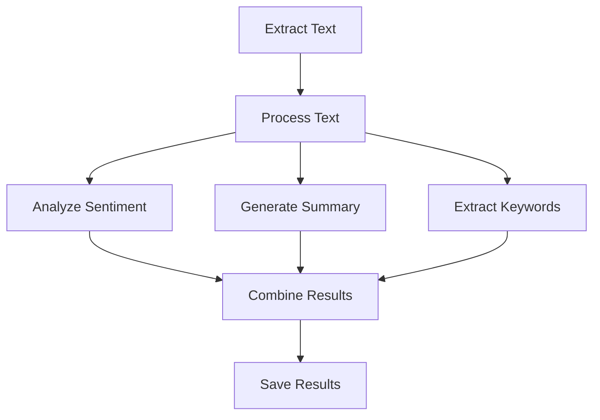

# Performance & Speed Issues

Slow workflows can be frustrating and may cause timeouts or browser crashes. This guide helps you identify performance bottlenecks and optimize workflow execution speed.

## ⚡ Quick Performance Fixes

**Try these first:**
- 🚀 **Close unnecessary browser tabs** - Reduces memory pressure
- 🚀 **Restart your browser** - Clears memory leaks and resets performance
- 🚀 **Update your browser** - Latest versions have performance improvements
- 🚀 **Disable other extensions** - Reduces resource competition
- 🚀 **Check available RAM** - Ensure sufficient system memory

## 🐌 Common Performance Problems

### Slow Content Extraction

#### Large Page Content

**Symptoms:**
- Workflows take minutes to extract simple data
- Browser becomes unresponsive during extraction
- "Page unresponsive" warnings appear

**Performance comparison:**

| Content Size | Extraction Time | Memory Usage | Recommended Action |
|--------------|----------------|--------------|-------------------|
| < 1MB | < 2 seconds | Low | No optimization needed |
| 1-5MB | 2-10 seconds | Medium | Use CSS selectors |
| 5-20MB | 10-30 seconds | High | Extract in chunks |
| > 20MB | > 30 seconds | Very High | Limit extraction scope |

**Optimization strategies:**

```javascript
// Instead of extracting all content
const allText = document.body.innerText; // Slow for large pages

// Use targeted selectors
const specificContent = document.querySelectorAll('.article-content p');
const limitedContent = Array.from(specificContent)
  .slice(0, 50) // Limit to first 50 paragraphs
  .map(p => p.textContent);
```

#### Multiple Extraction Operations

**Problem:** Running many extraction nodes simultaneously

**Solution - Sequential Processing:**


**Optimization techniques:**

| Approach | Speed | Memory | Best For |
|----------|-------|--------|----------|
| Single extraction | Fastest | Lowest | Simple data |
| Batched extraction | Medium | Medium | Multiple similar elements |
| Parallel extraction | Variable | Highest | Independent data sources |
| Streaming extraction | Consistent | Low | Large datasets |

### AI Processing Bottlenecks

#### Slow AI Analysis

**Common causes:**
- Large input text sent to AI models
- Complex prompts requiring extensive processing
- Multiple AI calls in sequence
- Using slower AI models

**Optimization strategies:**

| Problem | Cause | Solution |
|---------|-------|----------|
| Large text input | Sending entire page content | Summarize or chunk text first |
| Complex prompts | Overly detailed instructions | Simplify and focus prompts |
| Sequential AI calls | Waiting for each response | Batch similar requests |
| Slow model choice | Using most capable but slowest model | Use faster models for simple tasks |

**Text chunking example:**
```javascript
// Instead of processing entire article
const fullArticle = document.querySelector('.article').textContent; // 10,000+ words

// Chunk into manageable pieces
function chunkText(text, maxWords = 500) {
  const words = text.split(' ');
  const chunks = [];
  
  for (let i = 0; i < words.length; i += maxWords) {
    chunks.push(words.slice(i, i + maxWords).join(' '));
  }
  
  return chunks;
}

const chunks = chunkText(fullArticle, 300); // Process 300 words at a time
```

### Browser Resource Issues

#### Memory Consumption

**Symptoms:**
- Browser becomes sluggish during workflow execution
- "Out of memory" errors
- System becomes unresponsive

**Memory monitoring:**
```javascript
// Check memory usage (Chrome only)
if (performance.memory) {
  const memInfo = {
    used: Math.round(performance.memory.usedJSHeapSize / 1024 / 1024) + ' MB',
    total: Math.round(performance.memory.totalJSHeapSize / 1024 / 1024) + ' MB',
    limit: Math.round(performance.memory.jsHeapSizeLimit / 1024 / 1024) + ' MB'
  };
  console.log('Memory usage:', memInfo);
}
```

**Memory optimization:**

| Technique | Impact | Implementation |
|-----------|--------|----------------|
| Clear variables | Medium | Set large objects to `null` after use |
| Limit DOM queries | High | Cache DOM elements, avoid repeated queries |
| Process in batches | High | Break large operations into smaller chunks |
| Use streaming | Very High | Process data as it arrives, don't store all |

#### CPU Intensive Operations

**Symptoms:**
- High CPU usage during workflow execution
- Browser UI becomes unresponsive
- Fan noise increases significantly

**CPU optimization techniques:**
```javascript
// Use requestAnimationFrame for heavy processing
function processLargeDataset(data, callback) {
  let index = 0;
  const batchSize = 100;
  
  function processBatch() {
    const endIndex = Math.min(index + batchSize, data.length);
    
    // Process batch
    for (let i = index; i < endIndex; i++) {
      // Process data[i]
    }
    
    index = endIndex;
    
    if (index < data.length) {
      // Continue processing in next frame
      requestAnimationFrame(processBatch);
    } else {
      // Processing complete
      callback();
    }
  }
  
  processBatch();
}
```

## 🔧 Performance Diagnostic Tools

### Workflow Timing Analysis

**Add timing measurements:**
```javascript
// Measure individual node performance
const nodeTimings = {};

function measureNode(nodeName, operation) {
  const startTime = performance.now();
  
  const result = operation();
  
  const endTime = performance.now();
  nodeTimings[nodeName] = endTime - startTime;
  
  console.log(`${nodeName} took ${endTime - startTime}ms`);
  return result;
}

// Usage example
const extractedData = measureNode('ContentExtraction', () => {
  return document.querySelectorAll('.content p');
});
```

### Browser Performance Monitoring

**Performance API usage:**
```javascript
// Monitor overall workflow performance
performance.mark('workflow-start');

// ... workflow execution ...

performance.mark('workflow-end');
performance.measure('workflow-duration', 'workflow-start', 'workflow-end');

// Get measurements
const measures = performance.getEntriesByType('measure');
measures.forEach(measure => {
  console.log(`${measure.name}: ${measure.duration}ms`);
});
```

### Resource Usage Tracking

**Monitor resource consumption:**
```javascript
// Track resource usage over time
const resourceMonitor = {
  startTime: Date.now(),
  measurements: [],
  
  measure() {
    const now = Date.now();
    const measurement = {
      timestamp: now - this.startTime,
      memory: performance.memory ? {
        used: performance.memory.usedJSHeapSize,
        total: performance.memory.totalJSHeapSize
      } : null,
      timing: performance.now()
    };
    
    this.measurements.push(measurement);
    return measurement;
  },
  
  report() {
    console.table(this.measurements);
  }
};

// Use during workflow
resourceMonitor.measure(); // Before workflow
// ... workflow execution ...
resourceMonitor.measure(); // After workflow
resourceMonitor.report();
```

## 🎯 Optimization Strategies

### Content Extraction Optimization

#### Smart Selector Usage

**Efficient selectors:**
```javascript
// Slow - searches entire document
const slowQuery = document.querySelectorAll('*');

// Fast - specific and targeted
const fastQuery = document.querySelectorAll('.article-content p');

// Faster - use IDs when available
const fastestQuery = document.getElementById('main-content');
```

**Selector performance ranking:**
1. 🟢 **ID selectors** (`#content`) - Fastest
2. 🟡 **Class selectors** (`.article`) - Fast
3. 🟡 **Tag selectors** (`p`, `div`) - Medium
4. 🟠 **Attribute selectors** (`[data-id]`) - Slower
5. 🔴 **Complex selectors** (`div > p:nth-child(2)`) - Slowest

#### Batch Processing

**Process data in chunks:**
```javascript
// Instead of processing all at once
function processAllData(data) {
  return data.map(item => expensiveOperation(item)); // Blocks browser
}

// Process in batches with delays
async function processBatched(data, batchSize = 50) {
  const results = [];
  
  for (let i = 0; i < data.length; i += batchSize) {
    const batch = data.slice(i, i + batchSize);
    const batchResults = batch.map(item => expensiveOperation(item));
    results.push(...batchResults);
    
    // Allow browser to update UI
    await new Promise(resolve => setTimeout(resolve, 10));
  }
  
  return results;
}
```

### AI Processing Optimization

#### Prompt Optimization

**Efficient prompts:**
```javascript
// Slow - overly complex prompt
const slowPrompt = `
Please analyze this text in great detail, considering all possible interpretations,
cultural contexts, linguistic nuances, and provide a comprehensive analysis
including sentiment, themes, key points, and recommendations...
`;

// Fast - focused and specific
const fastPrompt = `
Extract the main topic and sentiment (positive/negative/neutral) from this text:
`;
```

#### Model Selection

**Choose appropriate models:**

| Task Type | Recommended Model | Speed | Accuracy |
|-----------|------------------|-------|----------|
| Simple classification | Fast/Small models | Very Fast | Good |
| Text summarization | Medium models | Fast | Very Good |
| Complex analysis | Large models | Slow | Excellent |
| Code generation | Specialized models | Medium | Excellent |

### Workflow Architecture Optimization

#### Parallel vs Sequential Processing

**Sequential (slower but safer):**


**Parallel (faster but more complex):**


#### Caching Strategies

**Implement smart caching:**
```javascript
// Cache expensive operations
const cache = new Map();

function cachedOperation(input) {
  const cacheKey = JSON.stringify(input);
  
  if (cache.has(cacheKey)) {
    console.log('Cache hit');
    return cache.get(cacheKey);
  }
  
  console.log('Cache miss - computing...');
  const result = expensiveOperation(input);
  cache.set(cacheKey, result);
  
  return result;
}
```

## 📊 Performance Benchmarking

### Workflow Performance Targets

**Acceptable performance ranges:**

| Operation Type | Target Time | Warning Threshold | Action Required |
|----------------|-------------|-------------------|-----------------|
| Simple extraction | < 2 seconds | > 5 seconds | Optimize selectors |
| Complex extraction | < 10 seconds | > 30 seconds | Reduce scope |
| AI processing | < 15 seconds | > 60 seconds | Optimize prompts |
| Data transformation | < 5 seconds | > 20 seconds | Batch processing |
| File operations | < 3 seconds | > 10 seconds | Check file size |

### Performance Testing

**Create performance tests:**
```javascript
// Performance test suite
const performanceTests = {
  async testExtraction() {
    const start = performance.now();
    const data = document.querySelectorAll('.test-content');
    const end = performance.now();
    
    return {
      operation: 'Content Extraction',
      duration: end - start,
      dataSize: data.length,
      passed: (end - start) < 2000 // 2 second threshold
    };
  },
  
  async testProcessing(data) {
    const start = performance.now();
    const processed = data.map(item => item.textContent.trim());
    const end = performance.now();
    
    return {
      operation: 'Data Processing',
      duration: end - start,
      itemCount: processed.length,
      passed: (end - start) < 5000 // 5 second threshold
    };
  }
};

// Run performance tests
async function runPerformanceTests() {
  const results = [];
  
  results.push(await performanceTests.testExtraction());
  // Add more tests...
  
  console.table(results);
  return results;
}
```

## 🚨 Performance Warning Signs

### Early Warning Indicators

**Watch for these signs:**
- ⚠️ **Extraction taking > 10 seconds** - Content too large or selectors inefficient
- ⚠️ **Memory usage > 500MB** - Potential memory leak or excessive data storage
- ⚠️ **CPU usage > 80%** - Processing too intensive, needs optimization
- ⚠️ **Browser becoming unresponsive** - Operations blocking UI thread
- ⚠️ **Frequent timeouts** - Network issues or processing bottlenecks

### Performance Degradation Patterns

**Common degradation causes:**

| Pattern | Cause | Solution |
|---------|-------|----------|
| Gradual slowdown | Memory leaks | Restart browser, optimize memory usage |
| Sudden performance drop | Resource exhaustion | Reduce batch sizes, add delays |
| Inconsistent timing | Network variability | Add retry logic, optimize requests |
| Progressive failure | Accumulating errors | Implement error recovery, reset state |

## 🔄 Ongoing Performance Maintenance

### Regular Performance Monitoring

**Monthly checklist:**
- [ ] Review workflow execution times
- [ ] Check browser memory usage patterns
- [ ] Update to latest browser version
- [ ] Clean browser cache and data
- [ ] Review and optimize slow workflows

### Performance Optimization Workflow

**Systematic optimization process:**
1. **Identify bottlenecks** - Use timing and profiling tools
2. **Prioritize improvements** - Focus on biggest impact first
3. **Implement optimizations** - Make targeted changes
4. **Test and validate** - Ensure improvements work
5. **Monitor results** - Track performance over time

### Best Practices for Fast Workflows

**Design principles:**
- 🎯 **Be specific** - Use targeted selectors and focused operations
- 🔄 **Process incrementally** - Break large operations into smaller chunks
- 💾 **Cache intelligently** - Store expensive computation results
- ⚡ **Optimize early** - Consider performance from the start
- 📊 **Measure everything** - Track performance metrics consistently