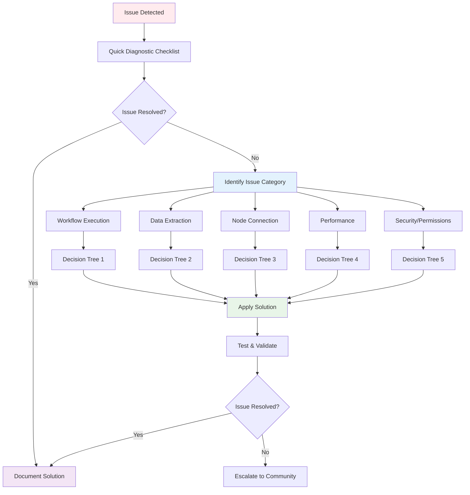
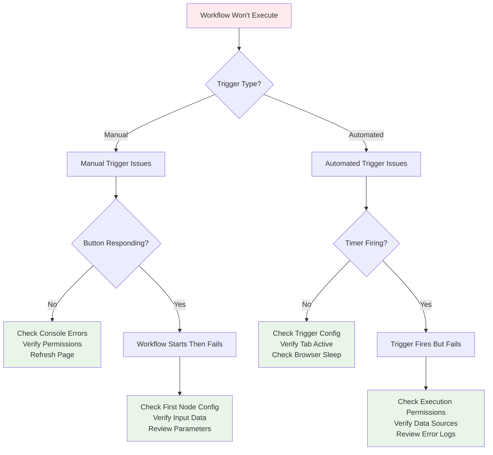
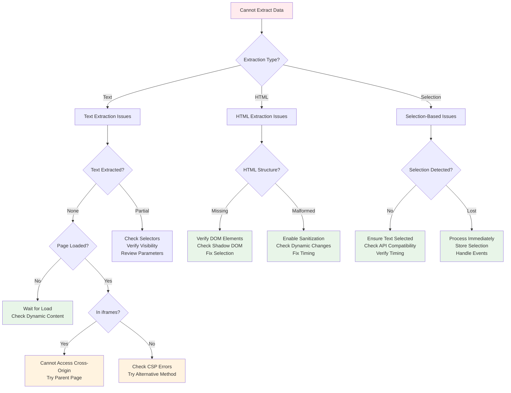
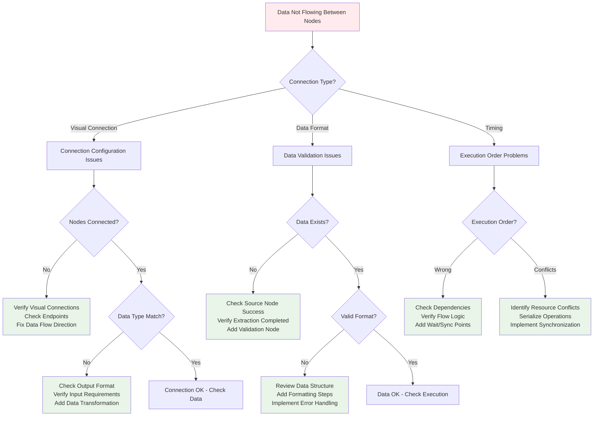
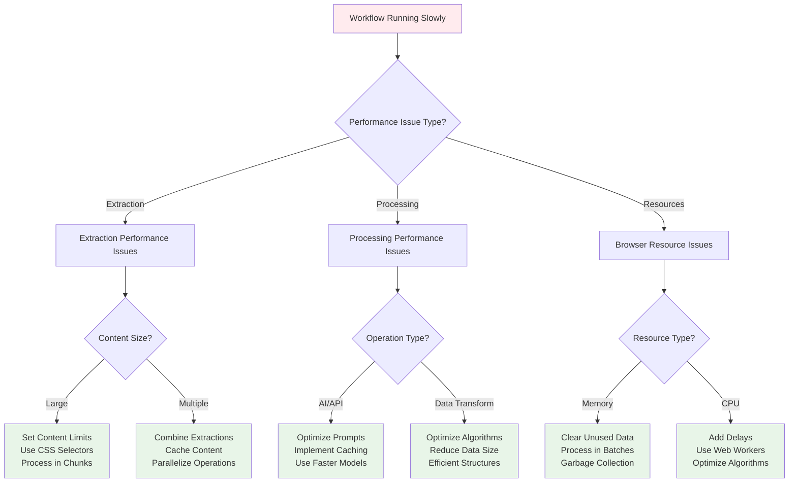
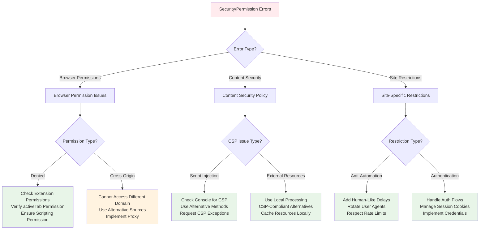

This guide provides a systematic approach to troubleshooting workflow issues using decision trees, diagnostic steps, and proven solutions for common problems.

## Troubleshooting Process Overview



## Quick Diagnostic Checklist

Before diving into detailed troubleshooting, run through this quick checklist:

### ✅ Basic System Check

- [ ] Browser extension is installed and enabled
- [ ] Required permissions are granted
- [ ] Page has finished loading completely
- [ ] No browser console errors visible
- [ ] Workflow nodes are properly connected

### ✅ Workflow Validation

- [ ] All required node parameters are configured
- [ ] Data flow connections are correct
- [ ] No missing or invalid input data
- [ ] Workflow execution permissions are granted

### ✅ Content Accessibility

- [ ] Target content is visible on the page
- [ ] No content security policy blocking access
- [ ] Elements are not in cross-origin iframes
- [ ] Dynamic content has finished loading

## Primary Issue Categories

### 🚫 Workflow Execution Issues

Problems with workflow starting, running, or completing

### 📊 Data Extraction Issues

Problems extracting content from web pages

### 🔗 Node Connection Issues

Problems with data flow between nodes

### ⚡ Performance Issues

Slow execution, timeouts, or resource problems

### 🛡️ Security & Permission Issues

Browser security restrictions or permission problems

## Detailed Troubleshooting Decision Trees

### Decision Tree 1: Workflow Won't Start



**Common Solutions**:

| Problem                    | Cause                        | Solution                              |
| -------------------------- | ---------------------------- | ------------------------------------- |
| Extension not responding   | Extension disabled/crashed   | Reload extension or restart browser   |
| Permission denied          | Missing required permissions | Grant permissions in browser settings |
| Workflow validation failed | Invalid node configuration   | Review and fix node parameters        |
| Trigger not firing         | Incorrect trigger setup      | Reconfigure trigger conditions        |

### Decision Tree 2: Data Extraction Failures



**Diagnostic Commands**:

```javascript
// Check if content is accessible
console.log(document.body.innerText.length);

// Verify selection exists
console.log(window.getSelection().toString());

// Check for iframe content
console.log(document.querySelectorAll("iframe").length);

// Test CSS selector
console.log(document.querySelectorAll("your-selector").length);
```

### Decision Tree 3: Node Connection Problems



**Data Flow Validation**:

```javascript
// Add debug nodes to check data flow
Debug Node Configuration:
- Input: Connect to suspect data flow
- Action: Log data to console
- Output: Pass data through unchanged

// Check data at each step
1. After extraction: Verify content exists
2. After processing: Verify transformation success
3. Before final action: Verify data format
```

### Decision Tree 4: Performance Problems



**Performance Monitoring**:

```javascript
// Add timing measurements
const startTime = performance.now();
// ... workflow execution ...
const endTime = performance.now();
console.log(`Execution time: ${endTime - startTime}ms`);

// Monitor memory usage
console.log(`Memory usage: ${performance.memory?.usedJSHeapSize || "N/A"}`);

// Check for performance bottlenecks
performance.mark("extraction-start");
// ... extraction code ...
performance.mark("extraction-end");
performance.measure("extraction-time", "extraction-start", "extraction-end");
```

### Decision Tree 5: Security & Permission Issues



**Permission Verification**:

```javascript
// Check extension permissions
chrome.permissions.contains(
  {
    permissions: ["activeTab", "scripting"],
  },
  (result) => {
    console.log("Permissions granted:", result);
  }
);

// Test content script injection
chrome.scripting.executeScript({
  target: { tabId: tabId },
  func: () => console.log("Content script injected successfully"),
});
```

## Common Error Messages & Solutions

### "Cannot access contents of URL"

**Cause**: Cross-origin security restriction
**Solutions**:

1. Ensure target page is same-origin or allows access
2. Use activeTab permission for current tab access
3. Implement server-side proxy for cross-origin data

### "Extension context invalidated"

**Cause**: Extension was reloaded or updated during execution
**Solutions**:

1. Reload the page and restart workflow
2. Check for extension updates
3. Implement error recovery in workflow

### "Script injection failed"

**Cause**: Content Security Policy or site restrictions
**Solutions**:

1. Check browser console for specific CSP violations
2. Use alternative extraction methods
3. Try different timing for script injection

### "Selection not found"

**Cause**: No text selected or selection lost
**Solutions**:

1. Ensure user has selected text before workflow execution
2. Add user instructions for text selection
3. Implement selection validation before processing

### "Timeout waiting for response"

**Cause**: Operation taking too long or hanging
**Solutions**:

1. Increase timeout limits in node configuration
2. Optimize processing to reduce execution time
3. Add progress indicators for long operations

## Systematic Debugging Approach

### Step 1: Isolate the Problem

1. **Identify Failure Point**: Determine which node or step is failing
2. **Reproduce Consistently**: Ensure the problem occurs reliably
3. **Simplify Workflow**: Remove non-essential nodes to isolate issue
4. **Test Individual Nodes**: Verify each node works independently

### Step 2: Gather Diagnostic Information

1. **Browser Console**: Check for JavaScript errors and warnings
2. **Network Tab**: Monitor network requests and responses
3. **Extension Logs**: Review extension-specific error messages
4. **Workflow Execution Logs**: Analyze step-by-step execution data

### Step 3: Apply Targeted Solutions

1. **Configuration Fixes**: Correct node parameters and settings
2. **Permission Updates**: Grant necessary browser permissions
3. **Code Modifications**: Adjust workflow logic or timing
4. **Alternative Approaches**: Use different nodes or methods

### Step 4: Validate and Monitor

1. **Test Fix**: Verify the solution resolves the issue
2. **Regression Testing**: Ensure fix doesn't break other functionality
3. **Monitor Performance**: Check for any performance impact
4. **Document Solution**: Record fix for future reference

## Prevention Strategies

### Robust Workflow Design

1. **Input Validation**: Always validate data before processing
2. **Error Handling**: Implement comprehensive error handling
3. **Fallback Options**: Provide alternative approaches for failures
4. **Progress Monitoring**: Track workflow execution progress

### Performance Optimization

1. **Resource Management**: Monitor and limit resource usage
2. **Caching**: Cache frequently accessed data and results
3. **Batch Processing**: Group operations for efficiency
4. **Lazy Loading**: Load data only when needed

### Security Best Practices

1. **Minimal Permissions**: Request only necessary permissions
2. **Data Sanitization**: Clean and validate all input data
3. **Secure Communication**: Use HTTPS for external communications
4. **Privacy Protection**: Handle user data responsibly

## Advanced Troubleshooting Tools

### Browser Developer Tools

```javascript
// Enable verbose logging
localStorage.setItem("debug", "true");

// Monitor performance
performance.mark("workflow-start");
// ... workflow execution ...
performance.mark("workflow-end");
performance.measure("workflow-duration", "workflow-start", "workflow-end");

// Check memory leaks
const observer = new PerformanceObserver((list) => {
  console.log("Performance entries:", list.getEntries());
});
observer.observe({ entryTypes: ["measure", "navigation"] });
```

### Extension Debugging

```javascript
// Background script debugging
chrome.runtime.onMessage.addListener((message, sender, sendResponse) => {
  console.log("Message received:", message);
  // Handle debugging messages
});

// Content script debugging
window.addEventListener("error", (event) => {
  console.error("Content script error:", event.error);
});
```

### Network Monitoring

```javascript
// Monitor fetch requests
const originalFetch = window.fetch;
window.fetch = function (...args) {
  console.log("Fetch request:", args);
  return originalFetch.apply(this, args).then((response) => {
    console.log("Fetch response:", response);
    return response;
  });
};
```

## Getting Additional Help

### Documentation Resources

- **[Node Reference](/nodes/)** - Complete node documentation
- **[Workflow Lifecycle](/usage/key-concepts/flow-logic/workflow-lifecycle/)** - How runs move from trigger to output
- **[Performance Guide](/usage/troubleshooting/performance-optimization/)** - Optimization techniques

### Community Support

- **[Help & Community](/usage/help-and-community/help/)** - Get assistance from community
- **[Contributing](/usage/help-and-community/contributing/)** - Report bugs and contribute fixes
- **GitHub Issues**: Report technical issues and bugs

### Professional Support

- **Enterprise Support**: Available for business users
- **Custom Development**: Professional workflow development services
- **Training Programs**: Comprehensive training for teams

## Related Resources

### Troubleshooting Guides

- **[Model Dependencies](/advanced-ai/concepts/model-dependencies/)** - AI dependency and credential issues
- **[Performance Optimization](/usage/troubleshooting/performance-optimization/)** - Performance problems
- **[Workflow Connections](/usage/troubleshooting/workflow-connections/)** - General debugging techniques

### Best Practices

- **[Permissions and Security](/usage/troubleshooting/permissions-security/)** - Security guidelines
- **[Performance Best Practices](/usage/troubleshooting/performance-optimization/)** - Performance optimization
- **[Flow Logic](/usage/key-concepts/flow-logic/)** - Proven execution patterns
