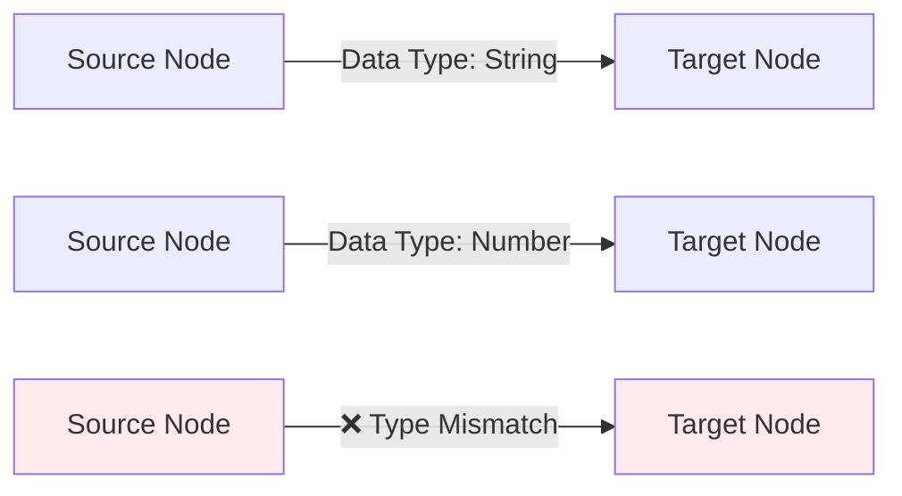
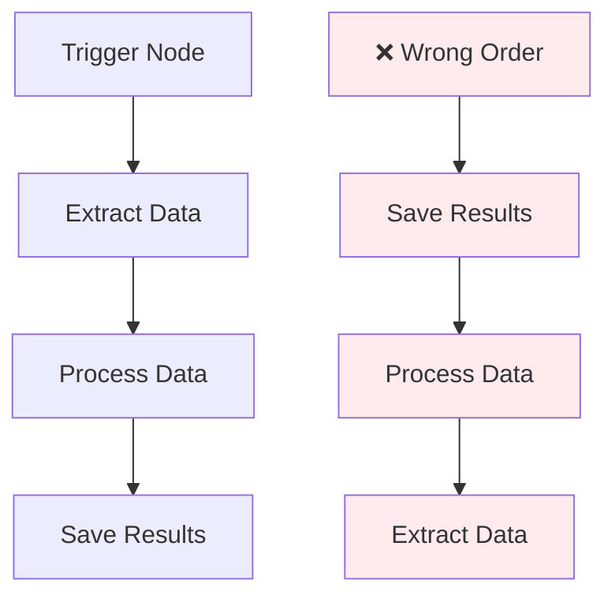
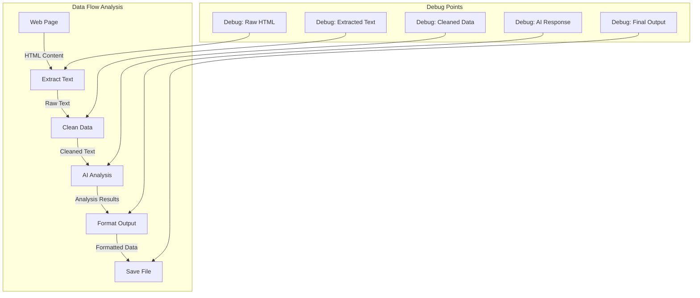
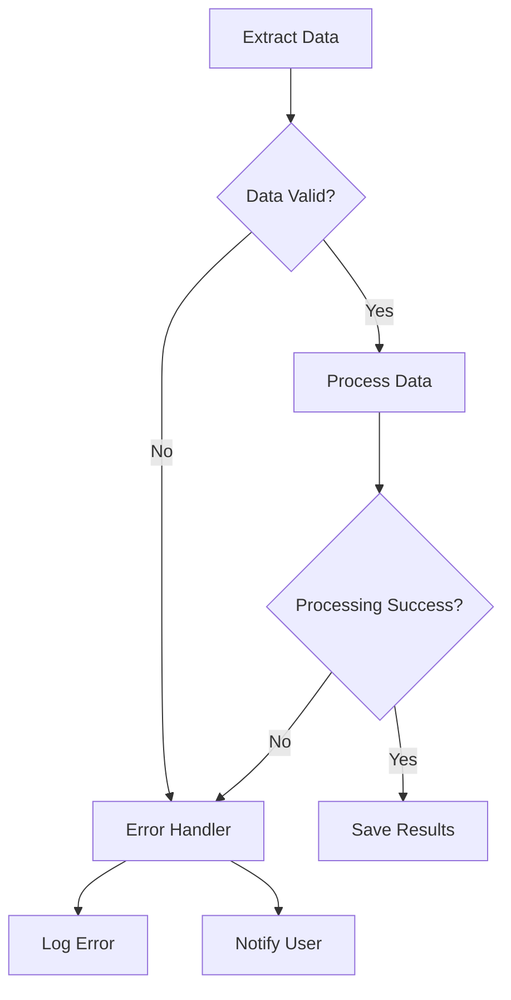

# Workflow Connection Issues

When nodes don't connect properly or data doesn't flow between them, your entire workflow breaks down. This guide helps you diagnose and fix connection and data flow problems.

## 🔗 Quick Connection Diagnostics

**Check these first:**
- 🔗 **Visual connections exist** - Ensure lines connect node outputs to inputs
- 🔗 **Data types match** - Verify output type matches input requirements
- 🔗 **Execution order is correct** - Check that dependencies run before dependent nodes
- 🔗 **No circular dependencies** - Ensure nodes don't create infinite loops
- 🔗 **All required inputs connected** - Verify mandatory inputs have data sources

## 🚫 Common Connection Problems

### Nodes Not Connecting

#### Visual Connection Issues

**Symptoms:**
- Cannot draw connection lines between nodes
- Connection lines disappear after creation
- Nodes appear connected but don't pass data

**Connection troubleshooting table:**

| Problem | Cause | Solution |
|---------|-------|----------|
| Cannot create connection | Incompatible data types | Check input/output type compatibility |
| Connection disappears | Invalid connection attempt | Verify connection endpoints are correct |
| Multiple connections to input | Input already connected | Remove existing connection first |
| Connection to wrong port | Clicked wrong connector | Ensure connection to correct input/output |

**Visual connection verification:**


#### Data Type Mismatches

**Common type compatibility issues:**

| Output Type | Compatible Inputs | Incompatible Inputs | Solution |
|-------------|------------------|-------------------|----------|
| String | Text, Any | Number (strict) | Use conversion node |
| Number | Numeric, Any | String (strict) | Use formatting node |
| Array | List, Collection | Single item | Use array processing |
| Object | Structured data | Primitive types | Use field extraction |
| Boolean | True/False, Any | Complex objects | Use conditional logic |

**Type conversion examples:**
```javascript
// String to Number conversion
const numberValue = parseFloat(stringValue);

// Number to String conversion
const stringValue = numberValue.toString();

// Array to String conversion
const stringValue = arrayValue.join(', ');

// Object to String conversion
const stringValue = JSON.stringify(objectValue);
```

### Data Not Flowing

#### Execution Order Problems

**Symptoms:**
- Nodes execute in wrong order
- Dependent nodes run before their dependencies
- Data arrives after node has already executed

**Execution flow debugging:**


**Execution order fixes:**

| Problem | Cause | Solution |
|---------|-------|----------|
| Async operations complete out of order | No proper waiting | Add synchronization nodes |
| Parallel branches interfere | Race conditions | Serialize critical operations |
| Dependencies not clear | Missing connections | Add explicit dependency connections |
| Timing issues | Network delays | Add wait/delay nodes |

#### Missing or Invalid Data

**Data validation checklist:**

```javascript
// Debug data flow between nodes
function debugDataFlow(nodeId, data) {
  console.log(`Node ${nodeId} received:`, {
    type: typeof data,
    value: data,
    isEmpty: data === null || data === undefined || data === '',
    isArray: Array.isArray(data),
    length: data?.length || 'N/A'
  });

  // Validate data structure
  if (typeof data === 'object' && data !== null) {
    console.log('Object keys:', Object.keys(data));
  }

  return data; // Pass through for next node
}
```

**Common data flow issues:**

| Issue | Symptoms | Diagnostic | Solution |
|-------|----------|------------|----------|
| Null/undefined data | Empty results | Check source node success | Add validation and error handling |
| Wrong data structure | Type errors | Inspect data format | Add transformation nodes |
| Partial data | Missing fields | Check extraction completeness | Improve source data extraction |
| Corrupted data | Unexpected values | Validate data integrity | Add data cleaning steps |

### Node Configuration Issues

#### Parameter Configuration Problems

**Symptoms:**
- Nodes execute but produce no output
- Error messages about missing parameters
- Unexpected node behavior

**Configuration validation:**

| Node Type | Required Parameters | Common Mistakes | Fixes |
|-----------|-------------------|-----------------|-------|
| Extraction nodes | CSS selectors, target elements | Wrong selectors | Test selectors in browser console |
| Processing nodes | Input data format, operations | Type mismatches | Verify input data structure |
| AI nodes | Prompts, model settings | Empty prompts | Provide clear, specific prompts |
| Output nodes | Destination, format | Missing destinations | Configure output targets |

**Parameter debugging:**
```javascript
// Validate node configuration
function validateNodeConfig(nodeType, config) {
  const validations = {
    extraction: {
      required: ['selector'],
      optional: ['attribute', 'multiple']
    },
    processing: {
      required: ['operation', 'inputData'],
      optional: ['options', 'format']
    },
    ai: {
      required: ['prompt', 'model'],
      optional: ['temperature', 'maxTokens']
    }
  };

  const nodeValidation = validations[nodeType];
  if (!nodeValidation) {
    return { valid: false, error: 'Unknown node type' };
  }

  // Check required parameters
  for (const param of nodeValidation.required) {
    if (!config[param]) {
      return { valid: false, error: `Missing required parameter: ${param}` };
    }
  }

  return { valid: true };
}
```

## 🔧 Advanced Connection Debugging

### Data Flow Visualization

**Create data flow diagrams:**


### Connection Testing Tools

**Systematic connection testing:**
```javascript
// Test node connections
class ConnectionTester {
  constructor() {
    this.testResults = [];
  }

  testConnection(sourceNode, targetNode, testData) {
    const test = {
      source: sourceNode.id,
      target: targetNode.id,
      timestamp: new Date().toISOString(),
      success: false,
      error: null,
      data: null
    };

    try {
      // Simulate data flow
      const output = sourceNode.process(testData);
      const result = targetNode.process(output);

      test.success = true;
      test.data = result;
    } catch (e) {
      test.error = e.message;
    }

    this.testResults.push(test);
    return test;
  }

  generateReport() {
    const summary = {
      total: this.testResults.length,
      passed: this.testResults.filter(t => t.success).length,
      failed: this.testResults.filter(t => !t.success).length,
      details: this.testResults
    };

    console.table(summary.details);
    return summary;
  }
}
```

### Workflow Validation

**Comprehensive workflow validation:**
```javascript
// Validate entire workflow structure
function validateWorkflow(workflow) {
  const validation = {
    nodes: [],
    connections: [],
    executionOrder: [],
    issues: []
  };

  // Validate nodes
  workflow.nodes.forEach(node => {
    const nodeValidation = {
      id: node.id,
      type: node.type,
      configured: node.isConfigured(),
      hasInputs: node.inputs.length > 0,
      hasOutputs: node.outputs.length > 0
    };

    if (!nodeValidation.configured) {
      validation.issues.push(`Node ${node.id} is not properly configured`);
    }

    validation.nodes.push(nodeValidation);
  });

  // Validate connections
  workflow.connections.forEach(connection => {
    const connectionValidation = {
      from: connection.source,
      to: connection.target,
      valid: connection.isValid(),
      typeMatch: connection.typesMatch()
    };

    if (!connectionValidation.valid) {
      validation.issues.push(`Invalid connection from ${connection.source} to ${connection.target}`);
    }

    validation.connections.push(connectionValidation);
  });

  // Check for circular dependencies
  const hasCycles = detectCycles(workflow);
  if (hasCycles) {
    validation.issues.push('Workflow contains circular dependencies');
  }

  return validation;
}
```

## 🎯 Connection Best Practices

### Robust Connection Design

**Connection design principles:**
1. **Explicit dependencies** - Make all data dependencies clear through connections
2. **Type safety** - Ensure compatible data types between connected nodes
3. **Error propagation** - Handle errors gracefully throughout the workflow
4. **Data validation** - Validate data at each connection point
5. **Fallback handling** - Provide alternative paths for failure scenarios

**Example robust connection pattern:**


### Data Transformation Strategies

**Handle type mismatches:**
```javascript
// Universal data transformer
function transformData(data, targetType) {
  switch (targetType) {
    case 'string':
      if (typeof data === 'object') {
        return JSON.stringify(data);
      }
      return String(data);

    case 'number':
      if (typeof data === 'string') {
        const parsed = parseFloat(data);
        return isNaN(parsed) ? 0 : parsed;
      }
      return Number(data);

    case 'array':
      if (!Array.isArray(data)) {
        return [data];
      }
      return data;

    case 'object':
      if (typeof data === 'string') {
        try {
          return JSON.parse(data);
        } catch {
          return { value: data };
        }
      }
      return data;

    default:
      return data;
  }
}
```

### Error Handling Patterns

**Implement comprehensive error handling:**
```javascript
// Error handling wrapper for node connections
function safeNodeExecution(node, inputData) {
  const result = {
    success: false,
    data: null,
    error: null,
    nodeId: node.id,
    timestamp: new Date().toISOString()
  };

  try {
    // Validate input data
    if (!validateInputData(node, inputData)) {
      throw new Error('Invalid input data for node');
    }

    // Execute node
    result.data = node.execute(inputData);
    result.success = true;

  } catch (error) {
    result.error = {
      message: error.message,
      stack: error.stack,
      type: error.constructor.name
    };

    // Log error for debugging
    console.error(`Node ${node.id} execution failed:`, error);

    // Attempt recovery
    result.data = attemptErrorRecovery(node, inputData, error);
  }

  return result;
}

function attemptErrorRecovery(node, inputData, error) {
  // Implement recovery strategies based on error type
  if (error.message.includes('timeout')) {
    // Retry with longer timeout
    return node.executeWithTimeout(inputData, 30000);
  }

  if (error.message.includes('type')) {
    // Attempt type conversion
    const convertedData = transformData(inputData, node.expectedInputType);
    return node.execute(convertedData);
  }

  // Return safe default
  return null;
}
```

## 📊 Connection Performance Optimization

### Efficient Data Flow

**Optimize data passing:**
```javascript
// Efficient data flow patterns
class DataFlowOptimizer {
  constructor() {
    this.cache = new Map();
    this.metrics = {
      cacheHits: 0,
      cacheMisses: 0,
      totalTransfers: 0
    };
  }

  transferData(sourceId, targetId, data) {
    this.metrics.totalTransfers++;

    // Check cache for expensive computations
    const cacheKey = `${sourceId}-${targetId}-${this.hashData(data)}`;

    if (this.cache.has(cacheKey)) {
      this.metrics.cacheHits++;
      return this.cache.get(cacheKey);
    }

    this.metrics.cacheMisses++;

    // Process data transfer
    const result = this.processTransfer(data);

    // Cache result if beneficial
    if (this.shouldCache(data, result)) {
      this.cache.set(cacheKey, result);
    }

    return result;
  }

  hashData(data) {
    // Simple hash for caching
    return JSON.stringify(data).length;
  }

  shouldCache(input, output) {
    // Cache expensive operations
    return JSON.stringify(input).length > 1000 ||
           JSON.stringify(output).length > 1000;
  }

  getMetrics() {
    return {
      ...this.metrics,
      cacheEfficiency: this.metrics.cacheHits / this.metrics.totalTransfers
    };
  }
}
```

### Connection Monitoring

**Monitor connection health:**
```javascript
// Connection health monitoring
class ConnectionMonitor {
  constructor() {
    this.connections = new Map();
    this.alerts = [];
  }

  monitorConnection(connectionId, sourceId, targetId) {
    const connection = {
      id: connectionId,
      source: sourceId,
      target: targetId,
      transfers: 0,
      errors: 0,
      avgTransferTime: 0,
      lastTransfer: null,
      health: 'good'
    };

    this.connections.set(connectionId, connection);
  }

  recordTransfer(connectionId, success, duration, dataSize) {
    const connection = this.connections.get(connectionId);
    if (!connection) return;

    connection.transfers++;
    connection.lastTransfer = new Date();

    if (success) {
      // Update average transfer time
      connection.avgTransferTime =
        (connection.avgTransferTime * (connection.transfers - 1) + duration) /
        connection.transfers;
    } else {
      connection.errors++;
    }

    // Update health status
    this.updateConnectionHealth(connection);
  }

  updateConnectionHealth(connection) {
    const errorRate = connection.errors / connection.transfers;
    const isSlowTransfer = connection.avgTransferTime > 5000; // 5 seconds

    if (errorRate > 0.1 || isSlowTransfer) {
      connection.health = 'poor';
      this.alerts.push({
        connectionId: connection.id,
        issue: errorRate > 0.1 ? 'High error rate' : 'Slow transfers',
        timestamp: new Date()
      });
    } else if (errorRate > 0.05) {
      connection.health = 'fair';
    } else {
      connection.health = 'good';
    }
  }

  getHealthReport() {
    const connections = Array.from(this.connections.values());

    return {
      totalConnections: connections.length,
      healthDistribution: {
        good: connections.filter(c => c.health === 'good').length,
        fair: connections.filter(c => c.health === 'fair').length,
        poor: connections.filter(c => c.health === 'poor').length
      },
      recentAlerts: this.alerts.slice(-10),
      slowestConnections: connections
        .sort((a, b) => b.avgTransferTime - a.avgTransferTime)
        .slice(0, 5)
    };
  }
}
```

## 🆘 When Connections Still Don't Work

### Alternative Connection Methods

**If standard connections fail:**

| Problem | Alternative Approach |
|---------|---------------------|
| Type incompatibility | Add transformation nodes |
| Timing issues | Use queue/buffer nodes |
| Complex data flow | Break into smaller workflows |
| Performance problems | Implement caching layers |
| Reliability issues | Add retry and fallback logic |

### Workflow Redesign Strategies

**When to redesign workflows:**
- More than 20% of connections fail regularly
- Execution time exceeds acceptable limits
- Error rates are consistently high
- Maintenance becomes difficult

**Redesign approaches:**
1. **Simplify data flow** - Reduce connection complexity
2. **Add intermediate nodes** - Break complex transformations into steps
3. **Implement error boundaries** - Isolate failure-prone sections
4. **Use standard patterns** - Follow proven workflow designs

### Getting Help with Connection Issues

**Information to provide when seeking help:**
- Workflow diagram showing all connections
- Error messages and logs
- Data samples at each connection point
- Node configuration details
- Expected vs. actual behavior
- Steps already tried to resolve the issue

**Useful debugging exports:**
- Workflow configuration JSON
- Connection test results
- Performance metrics
- Error logs with timestamps