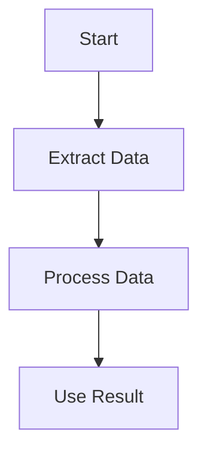
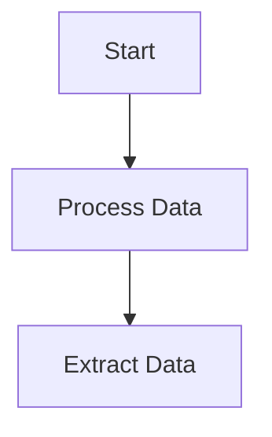

import { Image } from "astro:assets";
import Social from "@images/social.webp";

When a workflow does not behave as expected, the problem is often **how nodes are connected**, not the nodes themselves.

This page helps you understand:
- How workflow connections work
- The most common connection mistakes
- How to fix data flow and execution order issues

No programming knowledge is required.

---

## How Workflow Connections Work

A workflow is a sequence of **nodes connected together**.

Each connection:
- Sends data from one node to the next
- Defines the order in which nodes run
- Makes sure the right information arrives at the right step

If a connection is missing or incorrect, the workflow may:
- Stop early
- Run in the wrong order
- Produce empty or incorrect results

---

## First Things to Check

Before looking deeper, always verify:

- All nodes are visually connected
- No required input is left unconnected
- Connections go from **left to right** (earlier → later)
- There are no loops unless intentionally designed

If something looks disconnected, it usually is.

---

## Nodes Are Not Passing Data

### Nodes Look Connected but Nothing Happens

**Typical symptoms:**
- A node runs but outputs nothing
- The next node runs with empty data
- Results are missing or incomplete

**Most common reasons:**
- The previous node did not produce any data
- The wrong output was connected
- The connection goes to the wrong input

**What to do:**
- Click the previous node and confirm it produces output
- Reconnect the line to the correct input
- Remove unused connections

---

## Execution Order Problems

Nodes always run **in the order defined by connections**.

If a node runs too early, it may not receive the data it needs.

### Correct Execution Flow

### Common Wrong Pattern

**Fix:**

* Ensure every node that needs data is connected *after* the node that produces it
* Avoid branching too early unless necessary

---

## Missing or Empty Data

If a node receives empty data:

* The extraction step may have failed
* The page may not have loaded yet
* The selector or target may not exist

**Recommended fix:**
Add a **Wait for Element** node before extracting data.

Helpful links:

* [Wait node](/nodes/builtin/flow/wait/)
* [Troubleshooting Guide](/usage/troubleshooting/)

---

## Too Many Connections

Large workflows with many connections are harder to maintain.

**Signs the workflow is too complex:**

* Many lines crossing each other
* Multiple branches feeding the same node
* Difficult to tell where data comes from

**Better approach:**

* Split the workflow into smaller steps
* Keep each workflow focused on one task
* Reuse simpler workflows when possible

See:

* [Performance Optimization](/usage/troubleshooting/performance-optimization/)

---

## Visual Guide to Connections

<Image src={Social} alt="Illustration showing correct and incorrect workflow connections" />

---

## Best Practices for Reliable Connections

* Connect nodes only when data is actually needed
* Keep workflows linear when possible
* Avoid unnecessary branches
* Test each step before adding the next one
* Prefer clarity over compactness

A simple workflow is usually a reliable workflow.

---

## When Connection Issues Persist

If the workflow still fails:

* Test it on a simpler website
* Temporarily disable other browser extensions
* Remove nodes one by one to find the breaking point
* Rebuild the workflow from scratch if needed

Related pages:

* [Browser Compatibility](/usage/troubleshooting/browser-compatibility/)
* [Performance Optimization](/usage/troubleshooting/performance-optimization/)

---

## Summary

Most workflow connection issues come from:

* Missing or incorrect connections
* Nodes running in the wrong order
* Empty data passed between steps
* Overly complex workflows

In most cases, the fix is visual:
**check the lines, the order, and the data flow**.

If everything connects clearly, the workflow usually works.
