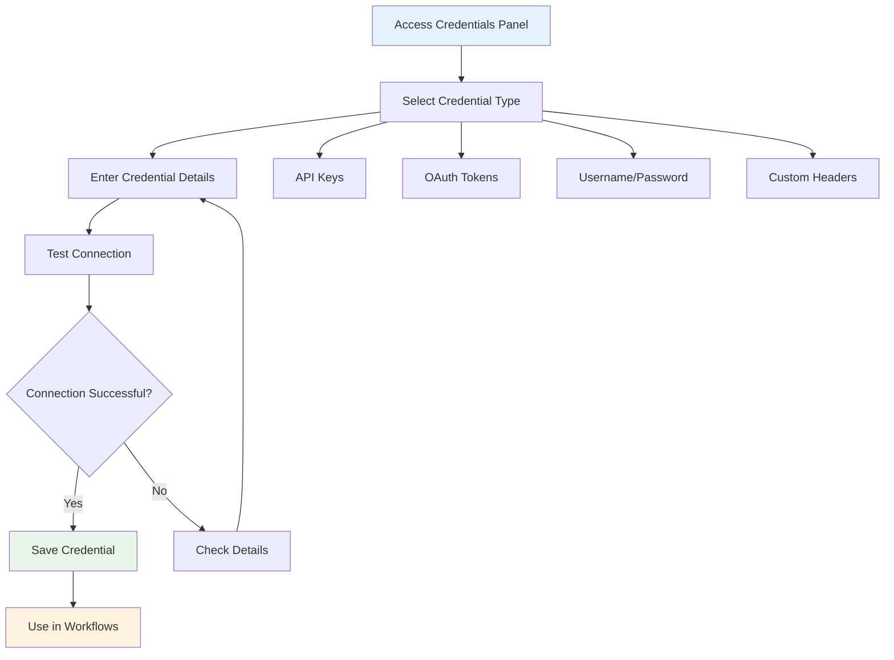

Credentials allow your workflows to securely connect to external services and APIs. Creating and managing credentials ensures your browser automation can integrate with various platforms while keeping sensitive information secure.

## Credential Creation Process

## Credential Management Best Practices

- **Security**: Credentials are encrypted and stored securely within the browser extension
- **Reusability**: Create credentials once and use them across multiple workflows
- **Testing**: Always test credentials before using them in production workflows
- **Organization**: Use descriptive names to easily identify credentials for different services
