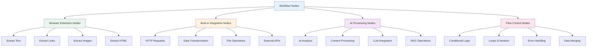

# Nodes

Nodes are the key building blocks of browser-based workflows. They perform a range of actions, including:

## Node Types and Functions

* Extracting data from web pages (text, links, images, HTML)
* Processing and manipulating browser context data
* Integrating with external services and APIs
* Controlling workflow logic and flow

Agentic Workflow Studio provides a collection of built-in nodes optimized for browser environments:

* [Browser extension nodes](/integration/extension/) for web page data extraction
* [Built-in integrations](/integration/builtin/) for data processing and external services
* [AI nodes](/advanced-ai/) for intelligent content analysis

## Add a node to your workflow

### Add a node to an empty workflow

1. Select **Add first step**. Agentic Workflow Studio opens the nodes panel, where you can search or browse browser extension nodes.
2. Select the node you want to use to start your browser automation.

Common starting nodes for browser workflows:
* **Get Selected Text**: Extract text that the user has selected on the page
* **Get All Text**: Extract all visible text from the current page
* **Get All Links**: Collect all links from the current page
* **Get All Images**: Gather all images from the current page

### Add a node to an existing workflow

Select the **Add node** connector between existing nodes. Agentic Workflow Studio opens the nodes panel, where you can search or browse all available nodes.

Popular node combinations for browser workflows:
* **Text extraction → AI analysis**: Extract page content and analyze it with AI
* **Link collection → Filter → Process**: Collect links, filter by criteria, then process selected links
* **Image extraction → Download**: Collect images and download them locally

--8<-- "_snippets/integrations/builtin/node-operations.md"

## Node controls

To view node controls, hover over the node on the canvas:

* **Execute step**: Run the node and see results from the current web page
* **Deactivate**: Temporarily disable the node without deleting it
* **Delete**: Remove the node from the workflow
* **Node context menu**: Access additional node actions:
	* Open node configuration
	* Execute step
	* Rename node
	* Deactivate node
	* Pin node (save current browser data for testing)
	* Copy node
	* Duplicate node
	* Clear selection
    * Delete node

## Browser-specific node behavior

Browser extension nodes have special behaviors:

* **Real-time data**: Nodes extract data from the current state of the web page
* **Context awareness**: Nodes understand the current page URL, title, and content structure
* **Security compliance**: Nodes respect browser security policies and cross-origin restrictions
* **Performance optimization**: Nodes are optimized for browser memory and processing limitations

## Node settings

The node settings under the **Settings** tab allow you to control browser-specific node behaviors and add documentation.

When active or set, they do the following:

* **Always Output Data**: The node returns an empty item even if no browser data is found during execution. Useful for browser nodes that might not find content on certain pages.
* **Execute Once**: The node executes once with data from the current page state. Useful for browser nodes that should only run once per page.
* **Retry On Fail**: When a browser operation fails (due to page loading, security restrictions, etc.), the node reruns until it succeeds.
* **On Error**:
    - **Stop Workflow**: Halts the entire workflow when a browser error occurs (page not found, security violation, etc.)
    - **Continue**: Proceeds to the next node despite browser errors, using the last valid data
    - **Continue (using error output)**: Continues workflow execution, passing browser error information to the next node

## Browser-specific settings

Additional settings for browser extension nodes:

* **Page wait time**: How long to wait for page content to load before extracting data
* **Element timeout**: Maximum time to wait for specific page elements to appear
* **Retry delay**: Time to wait between retry attempts for failed browser operations

You can document your browser workflows using node notes:

* **Notes**: Documentation about what the node extracts or processes from the web page
* **Display note in flow**: Shows the note in the workflow as a subtitle for better workflow documentation
