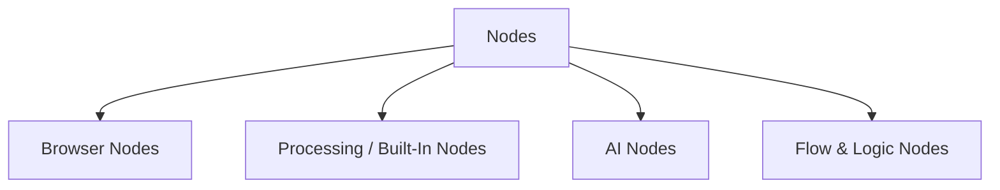

import { Card, CardGrid } from "@astrojs/starlight/components";

Nodes are the building blocks of workflows. Each node performs one action or step, such as extracting data, processing content, branching logic, or interacting with external systems.

---

## Types of Nodes

- **Browser Nodes** — interact with the web page (e.g. extract HTML, click elements, scroll)
- **Processing / Built-In Nodes** — transform data, call APIs, handle JSON, etc.
- **AI Nodes** — analyze or summarize text using local or embedded models
- **Logic / Flow Nodes** — manage branches, loops, error handling

You can browse all available node types in the [Node Library](/usage/node-library/) or by category:

- [Browser extension nodes](/integration/extension/)
- [Built-in integration / transformation nodes](/integration/builtin/)
- [AI / local models](/usage/local-ai/)
- [Control / flow logic nodes](/usage/key-concepts/flow-logic/)

---

## Adding a Node

### In a new (empty) workflow

1. Click **Add first step**.
2. Use the Node Library panel to search or browse nodes.
3. Click a node (e.g. **Get Selected Text**, **Get All Links**).
4. The node appears on the canvas, ready for configuration.

### In an existing workflow

1. Hover between two nodes or at a free connector point.
2. Click **Add node**.
3. Pick a node from the panel.
4. Connect it to previous and next nodes.

Common workflows often chain patterns like:

- **Extract → Analyze → Output**
- **Get Links → Filter → Visit & Process**
- **Click / Scroll → Extract → Condition / Branch**

---

## Node Controls & Actions

Hover or right-click a node to see its controls:

- **Execute Step** — run that node immediately
- **Deactivate** — temporarily disable (without deleting)
- **Delete** — remove the node
- **Open / Configure** — adjust parameters
- **Rename**, **Duplicate**, **Copy**, **Clear**, **Pin** — help manage and organize your workflow
- **Node Notes** — add documentation visible on the canvas

---

## Behavior of Browser Nodes

Browser-specific nodes behave differently:

- They operate on the **current page state**, extracting real-time content
- They respect browser security rules, cross-origin limits, and sandboxing
- They are optimized for browser memory and performance
- They can be configured (timeouts, retries, “always output”, etc.)
- They may fail if page structure changes or if content is not present

---

## Node Settings & Options

Under a node’s **Settings** tab, you’ll find options that control its behavior and reliability:

- **Always Output Data** — ensure the node emits an (empty) result even if nothing is found
- **Execute Once** — run only once per workflow run
- **Retry On Fail** — retry browser operations when they fail
- **On Error**:
  - Stop Workflow
  - Continue
  - Continue (passing error info downstream)

Browser nodes may have extra settings:

- Page wait / load time
- Element timeouts
- Retry delays
- Notes and descriptions — helpful for documenting what each node does

---

## Data Flow & Node Outputs

Nodes pass structured data in the form of _items_ (arrays of JSON objects). Each node’s output becomes the next node’s input.

- A node can emit zero, one, or many items
- Fields in the items can be manipulated via expressions (e.g. `{{ $json.text.length }}`)
- Use nodes like **Edit Fields** to create or reshape output fields

If you want more insight into how data moves between nodes, see [Key Concepts: Data Flow](/usage/key-concepts/).

---

## What’s next?

<CardGrid>
  <Card
    title="Using Browser Nodes"
    icon="seti:svg"
  >
    Explore all nodes that let you interact with web pages (click, extract, scroll, etc.).

    [Go  →](/integration/extension/)

  </Card>

<Card
title="Built-In / Integration Nodes"
icon="seti:svg"

>

Discover nodes for data transformations, HTTP calls, file operations, and more.

    [Go  →](/integration/builtin/)

  </Card>

<Card
title="Flow & Logic Nodes"
icon="seti:svg"

>

Understand how to build branching, loops, and conditional logic in workflows.

    [Go  →](/key-concepts/flow-logic/)

  </Card>
</CardGrid>
