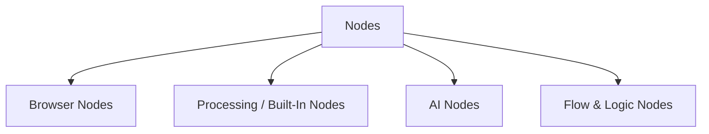

import { Card, CardGrid } from "@astrojs/starlight/components";

Nodes are the steps in your workflow.

Each node does one thing, like extracting text from a page, clicking a button, or formatting data.

---

## Types of Nodes

- **Browser nodes** — work with the page you’re on (extract text/HTML, click, scroll, fill forms)
- **Built‑in nodes** — transform data, call APIs, work with files, etc.
- **AI nodes** — summarize, classify, or analyze content
- **Logic nodes** — choose different paths (If), wait, handle errors

You can browse all available node types in the [Node Reference](/nodes/) or by category:

- [Browser extension nodes](/nodes/extension/)
- [Built-in integration / transformation nodes](/nodes/builtin/)
- [AI nodes and dependencies](/nodes/builtin/ai/)
- [Control / flow logic nodes](/usage/key-concepts/flow-logic/)

---

## Node runtime markers

Some nodes show a small icon in the node list and on the canvas that tells you **where the node runs** and what it needs:

- **☁️ Cloud** — the node sends your data to the awflow backend to do its work (for example the Google integration nodes). It needs a connected account and an internet connection.
- **🌐 External API** — the node calls a third-party service's API directly from your browser (for example Airtable, Notion, Slack). It sends data to that service and needs an account and internet connection.
- **🧩 Extension** — the node runs inside the awflow browser extension (the in-page action nodes). It needs the extension installed.
- **No marker** — the node runs entirely in your browser (data transforms, code, and similar). No account or network required.

Use these markers to see at a glance which steps in a workflow leave your device or require the extension.

---

## Adding a Node

### In a new (empty) workflow

1. Click **Add first step**.
2. Use the Node Library panel to search or browse nodes.
3. Click a node (e.g. **Get Selected Text**, **Get All Links**).
4. The node appears on the canvas, ready for configuration.

### In an existing workflow

1. Hover between two nodes or at a free connector point.
2. Click **Add node**.
3. Pick a node from the panel.
4. Connect it to previous and next nodes.

Common workflows often chain patterns like:

- **Extract → Analyze → Output**
- **Get Links → Filter → Visit & Process**
- **Click / Scroll → Extract → Condition / Branch**

---

## Node Controls & Actions

Hover or right-click a node to see common actions:

- **Execute Step** — run that node immediately
- **Deactivate** — temporarily disable (without deleting)
- **Delete** — remove the node
- **Open / Configure** — adjust parameters
- **Rename**, **Duplicate**, **Copy**, **Clear**, **Pin** — help manage and organize your workflow
- **Node Notes** — add documentation visible on the canvas

---

## Behavior of Browser Nodes

Browser nodes behave a little differently because they depend on the page:

- They operate on the **current page state**, extracting real-time content
- They respect browser security rules, cross-origin limits, and sandboxing
- They are optimized for browser memory and performance
- They can be configured (timeouts, retries, “always output”, etc.)
- They may fail if page structure changes or if content is not present

---

## Node Settings & Options

Under a node’s **Settings** tab, you’ll find options that control its behavior and reliability:

- **Always Output Data** — ensure the node emits an (empty) result even if nothing is found
- **Execute Once** — run only once per workflow run
- **Retry On Fail** — retry browser operations when they fail
- **On Error**:
  - Stop Workflow
  - Continue
  - Continue (passing error info downstream)

Browser nodes may have extra settings:

- Page wait / load time
- Element timeouts
- Retry delays
- Notes and descriptions — helpful for documenting what each node does

---

## Data Flow & Node Outputs

Nodes pass data to the next node.

Most of the time, the data is shown as JSON in the output panel.

- A node can emit zero, one, or many items
- Fields in the items can be manipulated via expressions (e.g. `{{ $json.text.length }}`)
- Use nodes like **Edit Fields** to create or reshape output fields

If you want more insight into how data moves between nodes, see [Data Structure](/usage/key-concepts/data/data-structure/) and [Item Linking](/usage/key-concepts/data/item-linking/).

---

## What’s next?

<CardGrid>
  <Card
    title="Using Browser Nodes"
    icon="seti:svg"
  >
    Explore all nodes that let you interact with web pages (click, extract, scroll, etc.).

    [Go  →](/nodes/extension/)

  </Card>

<Card
title="Built-In / Integration Nodes"
icon="seti:svg"

>

Discover nodes for data transformations, HTTP calls, file operations, and more.

    [Go  →](/nodes/builtin/)

  </Card>

<Card
title="Flow & Logic Nodes"
icon="seti:svg"

>

Understand how to build branching, loops, and conditional logic in workflows.

    [Go  →](/usage/key-concepts/flow-logic/)

  </Card>
</CardGrid>
