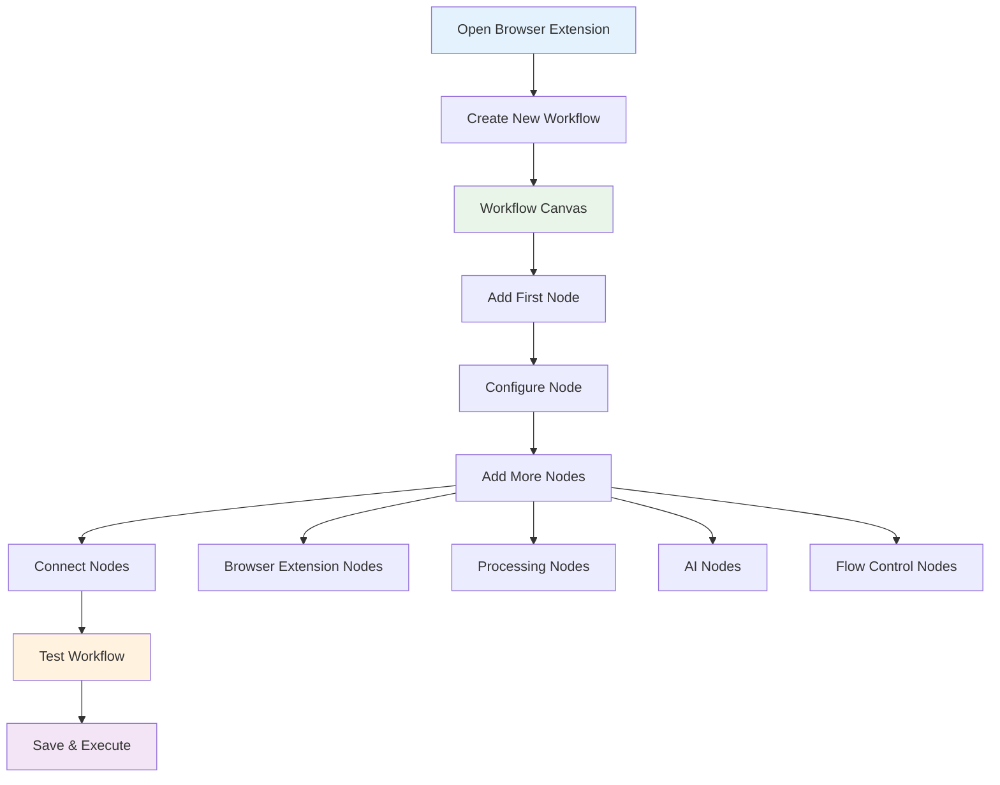

A workflow is a collection of nodes connected together to automate browser-based processes. You build workflows on the workflow canvas within the Agentic Workflow Studio browser extension interface.

## Workflow Creation Process

## Create a workflow

1. Click the Agentic Workflow Studio icon in your browser toolbar to open the extension.
2. In the workflow builder interface, select **Create New Workflow** or **Start from Scratch**.
3. The workflow canvas will open, ready for you to build your browser automation workflow.
4. Get started by adding your first node: select **Add first step...**

You can create workflows that:
* Extract data from the current web page
* Process content with AI
* Interact with multiple browser tabs
* Combine browser data with external services

If it's your first time building a browser workflow, you may want to use the [quickstart guides](/usage/getting-started/quick-starts/) to quickly try out browser extension features.

## Run workflows manually

You can run browser workflows manually at any time, which is particularly useful when building and testing workflows that interact with web page content.

To run manually:
1. Navigate to the web page you want to work with
2. Open the Agentic Workflow Studio extension
3. Select your workflow and click **Execute Workflow**

The workflow will process the current page content and execute all connected nodes.

## Browser workflow execution

Browser workflows execute within the context of the current web page and browser environment. This means:

* **Page context**: Workflows have access to the current page's content, including text, links, images, and HTML structure
* **Real-time data**: Each execution works with the current state of the web page
* **Browser limitations**: Workflows respect browser security policies and cross-origin restrictions
* **Performance**: Complex workflows may be limited by browser memory and processing capabilities

## Workflow persistence

Browser workflows are saved locally within the extension and persist across browser sessions. You can:
* Create multiple workflows for different automation tasks
* Switch between workflows based on the type of web page you're working with
* Export and import workflows to share with others or backup your automation
