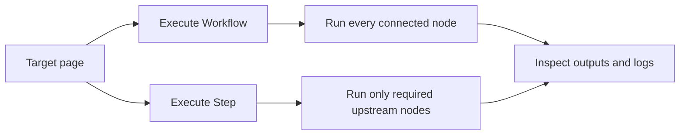

import { Card, CardGrid } from "@astrojs/starlight/components";

When you’re building a workflow, you usually want to test it as you go.

Agentic WorkFlow gives you two ways to do that:

- **Run the whole workflow** (end-to-end)
- **Run one step** (and only what’s needed before it)

---

## Run the whole workflow (full run)

Use this when you want to see the complete result from start to finish.

1. Open the page you want the workflow to work on.
2. In the designer, click **Execute Workflow**.
3. The workflow runs node by node.
4. Click a node to see its output.

---

## Run one step (partial run)

Use this when you’re adjusting one node and want fast feedback.

When you run a step, Agentic WorkFlow will also run any steps *before it* that are required to provide input.

1. Click the node you want to test.
2. Open its configuration panel.
3. Click **Execute Step**.

If you don’t want parts of the workflow to run while testing, temporarily disable those nodes.

---

## Common issues

---

> **"The destination node is not connected to any trigger."** 

- Partial execution requires that the workflow has a trigger node. If none is connected, you’ll see this error.  
- To fix: add a trigger (for development, a manual trigger is common).

> **"Please execute the whole workflow … existing execution data is too large."** 

- This occurs when your workflow is very complex or has many branches. Partial execution sends internal workflow structure for testing, which might exceed size constraints.  
- A workaround is to insert a **Limit** node to reduce output size during testing, then disable it for full runs.

---

## Execution Modes (Manual vs Production)

- **Manual execution** is initiated from the designer; it's meant for development.  
- **Production execution** runs automatically in response to a trigger (schedule, event, etc.).  
  - For this, workflows must include a non-manual trigger node and be activated.
  - Production runs do *not* respect pinned data — they always execute everything fully.

## Related Concepts

- [Workflow lifecycle](/usage/key-concepts/flow-logic/workflow-lifecycle/)
- [Execution order](/usage/key-concepts/flow-logic/execution-order/)
- [Workflow connections](/usage/troubleshooting/workflow-connections/)
