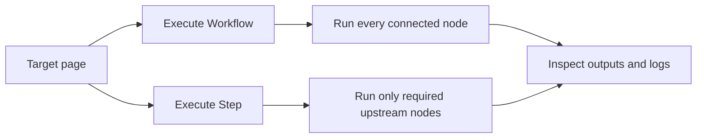

import { Card, CardGrid } from "@astrojs/starlight/components";

When you’re building a workflow, you usually want to test it as you go.

AWFlow gives you two ways to do that:

- **Run the whole workflow** (end-to-end)
- **Run one step** (and only what’s needed before it)

```mermaid
flowchart LR
  Page["Target page"] --> Full["Execute Workflow"]
  Page --> Step["Execute Step"]
  Full --> All["Run every connected node"]
  Step --> Needed["Run only required upstream nodes"]
  All --> Logs["Inspect outputs and logs"]
  Needed --> Logs
```

---

## Run the whole workflow (full run)

Use this when you want to see the complete result from start to finish.

1. Open the page you want the workflow to work on.
2. In the designer, click **Test Workflow**.
3. The workflow runs node by node. The button turns into **Running… 2 of 4 | Stop** so you can see how far it got.
4. When it finishes, the **Last run** tab of the panel on the right says what happened. Click a node to see its output.

### One run at a time

While a run is in progress, every other way to start one — **Test Workflow**, a node's play button, **Test step**, **Run again**, **Run once to test** — is disabled, with a tooltip saying why. Two runs at once would mix their outputs and logs.

You can keep editing during a run. Your changes don't affect the run in progress, and they stay marked as unsaved until you save.

### Stop a run

Click **Stop** on the running button. The step that is already running finishes; nothing after it starts. The run is recorded as canceled, and the **Last run** tab shows how many steps ran before it stopped.

### When a run fails

The **Last run** tab explains the failure in plain words instead of showing the raw error:

- **What happened**, e.g. *"Get weather couldn't reach the service."*
- **Why it probably happened** — a network problem or a site that blocks requests from the browser, a refused key (401 / 403), a rate limit (429, with a countdown when the service says how long to wait), a used-up quota, a missing connection or a field that needs attention.
- **Try this** — a few concrete things to do, and a button to open the step's settings, reconnect it or run again.
- **Show technical details** — the step, time, run id, the error the step reported and its input, with **Copy details** for a bug report.

You get a single notification for a failed run, and only when the panel isn't on screen (for example when the run was started from the workflow list or the tab was in the background). Testing a single step still shows a short notification when it fails.

---

## Run one step (partial run)

Use this when you’re adjusting one node and want fast feedback.

When you run a step, AWFlow will also run any steps *before it* that are required to provide input.

1. Click the node you want to test.
2. Open its configuration panel.
3. Click **Test step**.

If you don’t want parts of the workflow to run while testing, temporarily disable those nodes.

---

## Common issues

---

> **"The destination node is not connected to any trigger."** 

- Partial execution requires that the workflow has a trigger node. If none is connected, you’ll see this error.  
- To fix: add a trigger (for development, a manual trigger is common).

> **"Please execute the whole workflow … existing execution data is too large."** 

- This occurs when your workflow is very complex or has many branches. Partial execution sends internal workflow structure for testing, which might exceed size constraints.  
- A workaround is to insert a **Limit** node to reduce output size during testing, then disable it for full runs.

---

## Execution Modes (Manual vs Production)

- **Manual execution** is initiated from the designer; it's meant for development.  
- **Production execution** runs automatically in response to a trigger (schedule, event, etc.).  
  - For this, workflows must include a non-manual trigger node and be activated.
  - Production runs do *not* respect pinned data — they always execute everything fully.
  - A run that reaches a [Wait For Approval](/nodes/builtin/flow/wait-for-approval/) node pauses and waits for a human decision — it can be approved, rejected, or cancelled from the Executions pane rather than finishing immediately.

## Related Concepts

- [Workflow lifecycle](/usage/key-concepts/flow-logic/workflow-lifecycle/)
- [Execution order](/usage/key-concepts/flow-logic/execution-order/)
- [Workflow connections](/usage/troubleshooting/workflow-connections/)
- [Wait For Approval](/nodes/builtin/flow/wait-for-approval/)
